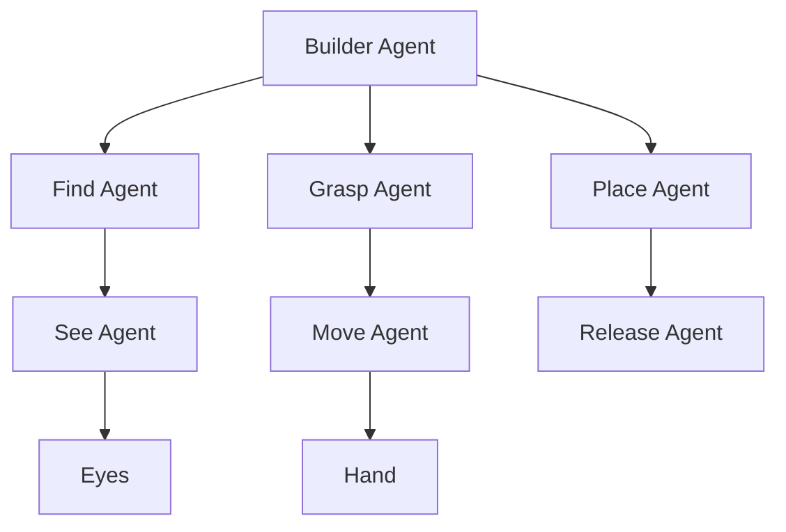

The opening chapter of *The Society of Mind* establishes the book's foundational metaphor. Minsky asks: how can a mind be built from parts that are not themselves mindful? He introduces **agents** — tiny mental processes that each perform simple tasks — and shows how their interactions produce what we experience as thought.

Minsky uses the example of a child building a tower of blocks to illustrate how even a simple activity requires the cooperation of many agents: one for grasping, one for balancing, one for deciding where to place. No single agent "understands" building, yet together they accomplish it.

<!-- beautiful-mermaid comparison -->

  
Agent Hierarchy: Builder → Specialists → Effectors

  

<!-- end beautiful-mermaid comparison -->

## Sections

| Section | Title | Link |
|---------|-------|------|
| 1.1 | The Agents of the Mind | [Read](/read/original/01-building-blocks/) |
| 1.2 | The Mind and the Brain | [Read](/read/original/01-building-blocks/) |
| 1.3 | The Society of Mind | [Read](/read/original/01-building-blocks/) |

## Key Themes

- Intelligence emerges from the interaction of simple, mindless agents
- No single agent needs to understand the whole task
- The "society" metaphor for how minds are organized
- The relationship between mind and brain

## Related Concepts

- [Agents](/concepts/agents/) — the fundamental building blocks introduced here
- [Agencies](/concepts/agencies/) — how agents organize into functional groups
- [Proto-specialists](/concepts/proto-specialists/) — built-in agents present from birth

## Read This Chapter

- [Original text](/read/original/01-building-blocks/)
- [Side-by-side companion](/read/side-by-side/01-building-blocks/)
