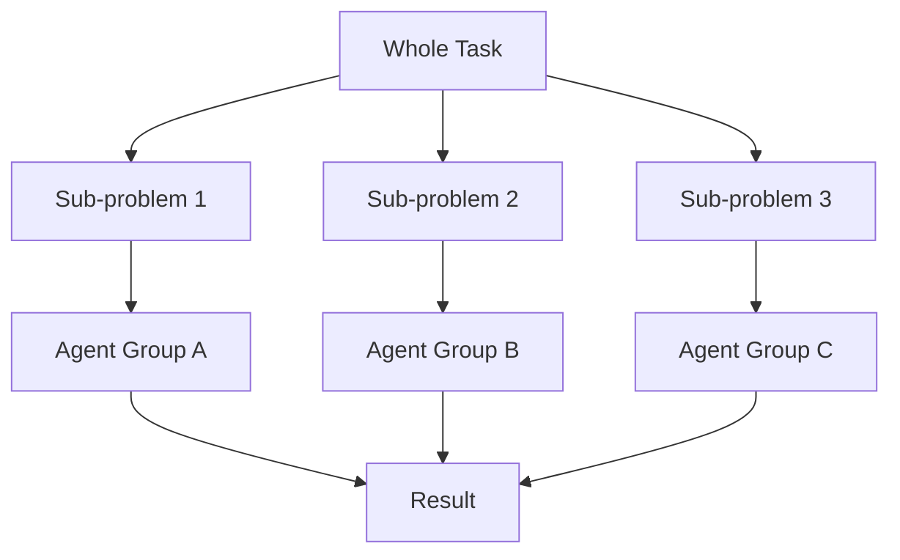

Chapter 2 examines a fundamental tension in understanding minds: we experience our thoughts as unified wholes, yet they are built from many separate parts. Minsky argues that the feeling of wholeness is itself a product of how our agents interact, not evidence of some indivisible mental substance.

He introduces the idea that complex mental activities can be decomposed into simpler sub-problems, each handled by specialized agents. The challenge is understanding how these parts coordinate to produce coherent behavior without any central executive directing them.

<!-- beautiful-mermaid comparison -->

  
Tokyo-night theme (beautiful-mermaid):

  

<!-- end beautiful-mermaid comparison -->

## Sections

| Section | Title | Link |
|---------|-------|------|
| 2.1 | Components and Connections | [Read](/read/original/02-wholes-and-parts/) |
| 2.2 | Novelists and Reductionists | [Read](/read/original/02-wholes-and-parts/) |
| 2.3 | Parts and Wholes | [Read](/read/original/02-wholes-and-parts/) |

## Key Themes

- The illusion of wholeness in mental experience
- Decomposition of complex tasks into sub-problems
- Emergence: how wholes arise from interacting parts
- Reductionism versus holism in understanding mind

## Related Concepts

- [Agents](/concepts/agents/) — the parts that compose the whole
- [Agencies](/concepts/agencies/) — how parts organize into functional wholes
- [Consciousness](/concepts/consciousness/) — the experience of unified wholeness

## Read This Chapter

- [Original text](/read/original/02-wholes-and-parts/)
- [Side-by-side companion](/read/side-by-side/02-wholes-and-parts/)
