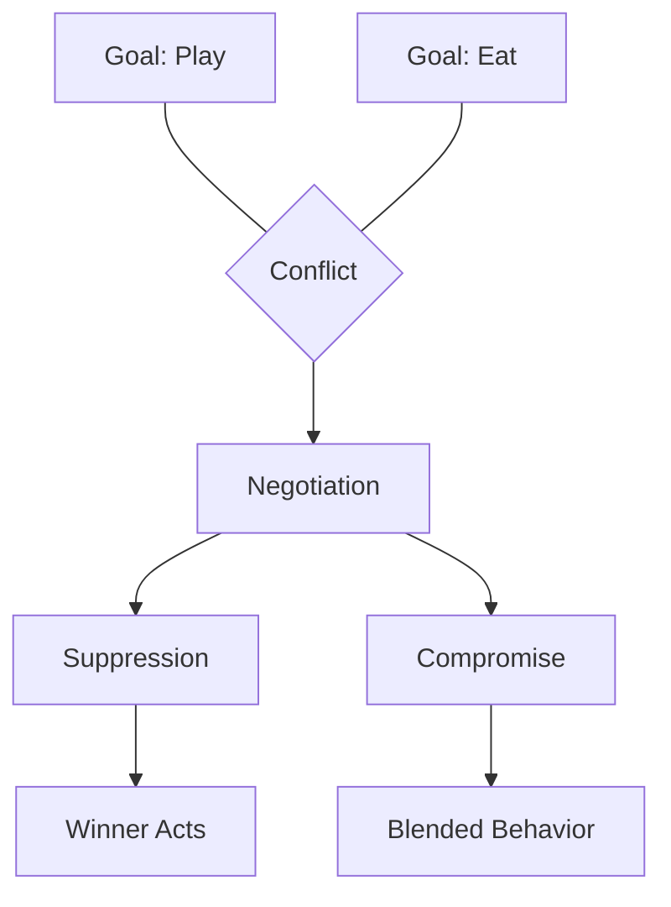

When multiple agents want different things, how does the mind decide what to do? Chapter 3 tackles the problem of internal conflict. Minsky shows that the mind is not a harmonious unity but a battleground where agents compete for control, negotiate, and sometimes suppress one another.

Rather than a single decision-maker, the mind uses various conflict-resolution strategies: some agents can inhibit others, priorities can shift based on context, and compromises emerge from the balance of competing forces. This chapter lays the groundwork for understanding censors and suppressors later in the book.

<!-- beautiful-mermaid comparison -->

  
Conflict Resolution: Goals → Negotiation → Behavior

  

<!-- end beautiful-mermaid comparison -->

## Sections

| Section | Title | Link |
|---------|-------|------|
| 3.1 | Conflict | [Read](/read/original/03-conflict-and-compromise/) |
| 3.2 | Negotiating Among Agents | [Read](/read/original/03-conflict-and-compromise/) |
| 3.3 | Hierarchies | [Read](/read/original/03-conflict-and-compromise/) |

## Key Themes

- Internal conflict as a normal feature of minds
- Suppression and inhibition among agents
- Compromise as emergent behavior
- Hierarchical control structures

## Related Concepts

- [Agents](/concepts/agents/) — the competing parties in mental conflicts
- [Censors](/concepts/censors/) — agents that suppress known bad ideas
- [Agencies](/concepts/agencies/) — hierarchies that manage conflict

## Read This Chapter

- [Original text](/read/original/03-conflict-and-compromise/)
- [Side-by-side companion](/read/side-by-side/03-conflict-and-compromise/)
