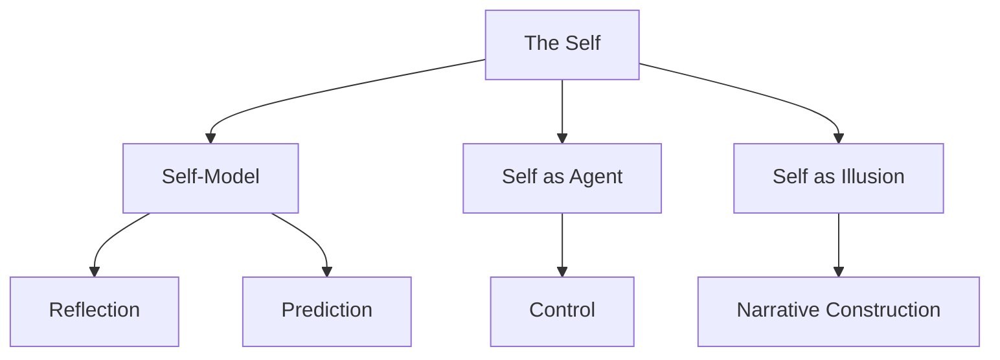

What is the self? Chapter 4 challenges the intuitive notion that there is a single "I" that thinks, feels, and decides. Minsky argues that the self is not a thing but a process — or rather, many processes. What we experience as a unified self is actually a shifting coalition of agents that changes from moment to moment.

This chapter introduces the idea that the self is a kind of mental model we construct to explain our own behavior. We need the concept of "self" to manage our internal society, but it does not correspond to any single agent or location in the mind.

<!-- beautiful-mermaid comparison -->

  
Tokyo-night theme (beautiful-mermaid):

  

<!-- end beautiful-mermaid comparison -->

## Sections

| Section | Title | Link |
|---------|-------|------|
| 4.1 | The Self | [Read](/read/original/04-the-self/) |
| 4.2 | One Self or Many? | [Read](/read/original/04-the-self/) |
| 4.3 | The Soul | [Read](/read/original/04-the-self/) |

## Key Themes

- The self as a constructed model, not a fixed entity
- Multiple sub-selves and shifting coalitions
- Self-models and self-knowledge
- The relationship between self and consciousness

## Related Concepts

- [Consciousness](/concepts/consciousness/) — the illusion of unified experience
- [Agents](/concepts/agents/) — the many parts that compose the "self"
- [Agencies](/concepts/agencies/) — coalitions that act as temporary selves

## Read This Chapter

- [Original text](/read/original/04-the-self/)
- [Side-by-side companion](/read/side-by-side/04-the-self/)
