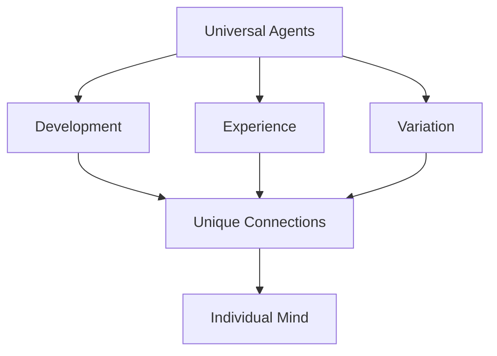

If all minds are built from similar agents, why is each person unique? Chapter 5 explores how individuality emerges from the particular way agents are connected, trained, and organized through experience. The raw materials may be universal, but the architecture each mind builds is singular.

Minsky discusses how developmental history, learning experiences, and even random variations in how agents connect create distinctive mental personalities. Two people may share the same types of agents yet think in profoundly different ways because of how those agents have been wired together.

<!-- beautiful-mermaid comparison -->

  
Mind Development: Universal Agents → Unique Connections

  

<!-- end beautiful-mermaid comparison -->

## Sections

| Section | Title | Link |
|---------|-------|------|
| 5.1 | Individuality | [Read](/read/original/05-individuality/) |
| 5.2 | The Development of Personality | [Read](/read/original/05-individuality/) |
| 5.3 | Traits and Dispositions | [Read](/read/original/05-individuality/) |

## Key Themes

- Individuality emerging from common building blocks
- The role of development in shaping mental architecture
- How experience creates unique connection patterns
- Personality as a product of agent organization

## Related Concepts

- [Agents](/concepts/agents/) — the universal building blocks
- [Proto-specialists](/concepts/proto-specialists/) — innate agents shared across individuals
- [K-lines](/concepts/k-lines/) — experience-shaped memory connections

## Read This Chapter

- [Original text](/read/original/05-individuality/)
- [Side-by-side companion](/read/side-by-side/05-individuality/)
