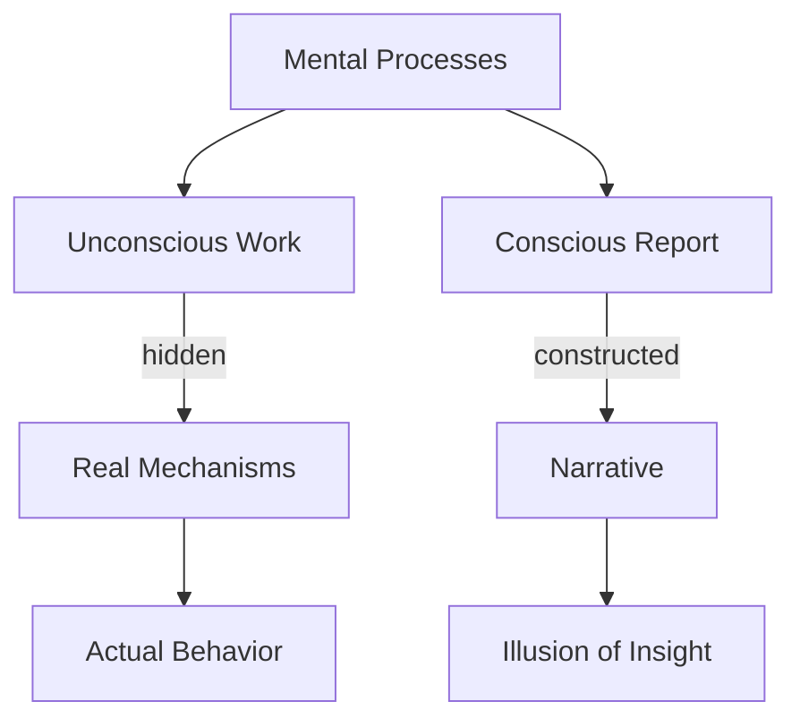

We often feel we can look inward and observe our own thinking, but Minsky argues that introspection is deeply unreliable. Chapter 6 reveals that most of the mind's work happens below the threshold of awareness. What we call "insight" is typically a post-hoc narrative constructed by a few agents, not a direct observation of mental processes.

This has profound implications: if we cannot directly observe how our minds work, then commonsense psychology — our folk theories about thinking — may be systematically misleading. Understanding the society of mind requires looking beyond what introspection tells us.

## Sections

| Section | Title | Link |
|---------|-------|------|
| 6.1 | Consciousness of Self | [Read](/read/original/06-insight-and-introspection/) |
| 6.2 | Signals and Signs | [Read](/read/original/06-insight-and-introspection/) |
| 6.3 | Internal Communication | [Read](/read/original/06-insight-and-introspection/) |

## Key Themes

- The limits of introspection
- Unconscious processing as the bulk of cognition
- Post-hoc narrative construction
- Why folk psychology misleads

## Related Concepts

- [Consciousness](/concepts/consciousness/) — what introspection reveals and conceals
- [Agents](/concepts/agents/) — most agents work below conscious awareness
- [Censors](/concepts/censors/) — unconscious regulators we cannot observe

## Read This Chapter

- [Original text](/read/original/06-insight-and-introspection/)
- [Side-by-side companion](/read/side-by-side/06-insight-and-introspection/)
