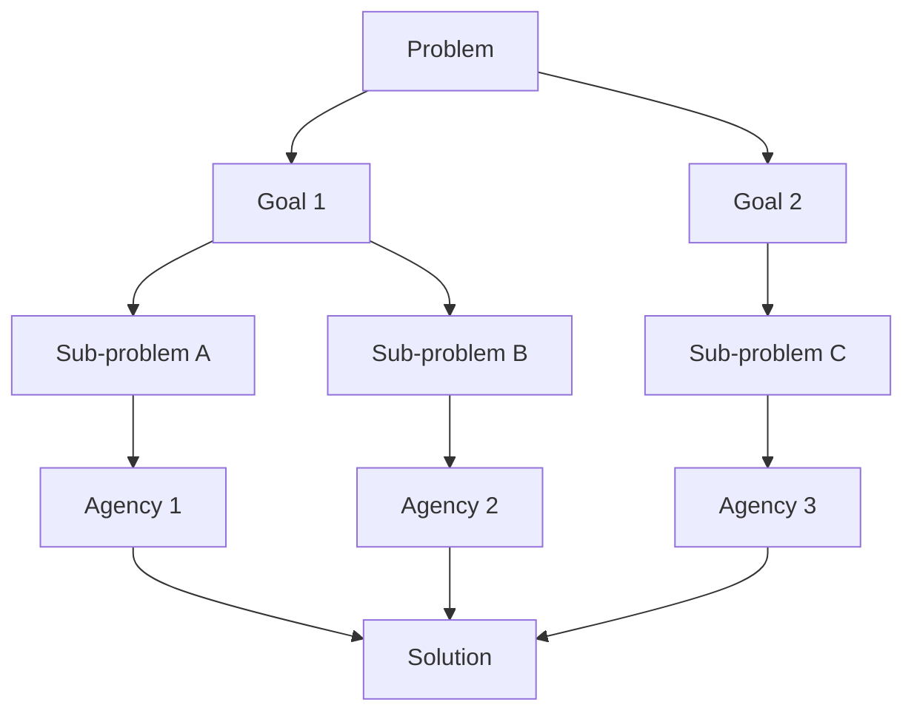

How do minds decide what to do? Chapter 7 explores goal-setting and problem-solving within the society of mind framework. Minsky shows that goals are not simple desires but complex structures involving multiple agents that must coordinate to define what "success" means and how to pursue it.

The chapter introduces the idea that problems are solved by breaking them into sub-problems, each assigned to different agencies. Goals can conflict, shift in priority, and be abandoned — all without any central planner. The mind's ability to juggle multiple goals simultaneously is one of its most remarkable features.

<!-- beautiful-mermaid comparison -->

  
Tokyo-night theme (beautiful-mermaid):

  

<!-- end beautiful-mermaid comparison -->

## Sections

| Section | Title | Link |
|---------|-------|------|
| 7.1 | Problems and Goals | [Read](/read/original/07-problems-and-goals/) |
| 7.2 | Problem Reduction | [Read](/read/original/07-problems-and-goals/) |
| 7.3 | Planning | [Read](/read/original/07-problems-and-goals/) |

## Key Themes

- Goal-setting as a multi-agent process
- Problem decomposition and sub-goals
- Conflicting goals and priority management
- Planning without a central planner

## Related Concepts

- [Agencies](/concepts/agencies/) — functional groups that pursue goals
- [Agents](/concepts/agents/) — the workers that execute sub-tasks
- [Censors](/concepts/censors/) — agents that block unproductive goal pursuit

## Read This Chapter

- [Original text](/read/original/07-problems-and-goals/)
- [Side-by-side companion](/read/side-by-side/07-problems-and-goals/)
