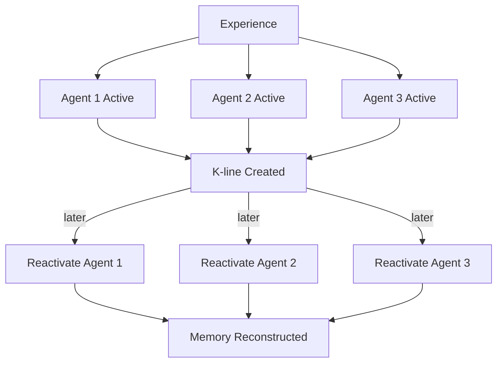

Chapter 8 presents one of the book's most original contributions: the theory of **K-lines** (knowledge lines). Rather than storing memories as static records, Minsky proposes that memory works by recording which agents were active during an experience and creating connections that can reactivate those same agents later.

When you remember something, you are not retrieving a stored file — you are partially re-creating the original mental state. K-lines connect to the agents that were active during learning, and activating a K-line brings back a partial version of that earlier state. This explains why memories are reconstructive rather than reproductive.

## Sections

| Section | Title | Link |
|---------|-------|------|
| 8.1 | K-lines: A Theory of Memory | [Read](/read/original/08-a-theory-of-memory/) |
| 8.2 | Re-membering | [Read](/read/original/08-a-theory-of-memory/) |
| 8.3 | Levels of Memory | [Read](/read/original/08-a-theory-of-memory/) |

## Key Themes

- K-lines as connections to previously active agents
- Memory as reconstruction, not retrieval
- How partial reactivation creates recognition and recall
- Levels and types of memory

## Related Concepts

- [K-lines](/concepts/k-lines/) — the memory mechanism introduced here
- [Agents](/concepts/agents/) — the units whose states are recorded
- [Frames](/concepts/frames/) — structured knowledge that interacts with memory

## Read This Chapter

- [Original text](/read/original/08-a-theory-of-memory/)
- [Side-by-side companion](/read/side-by-side/08-a-theory-of-memory/)
