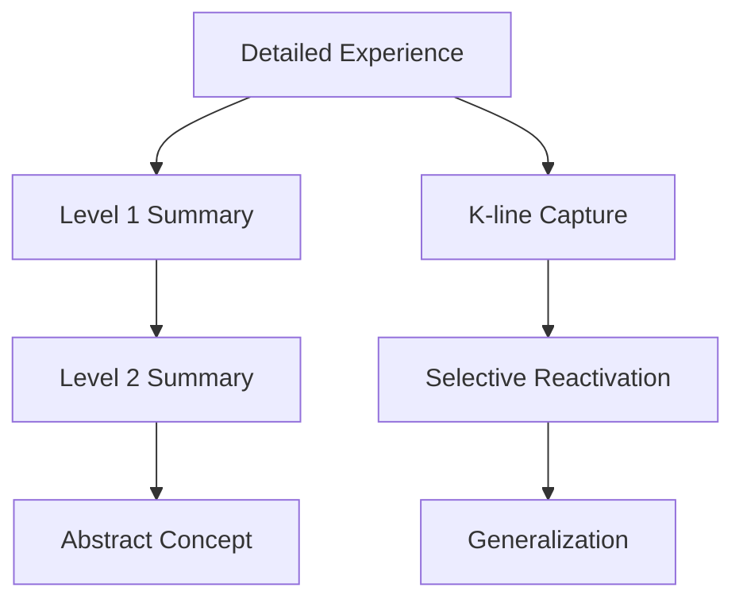

The mind cannot retain every detail of every experience. Chapter 9 explores how mental summaries compress complex experiences into manageable representations. Minsky shows that summarization is not merely a convenience but a fundamental requirement for intelligence — without it, the mind would drown in detail.

Summaries work at multiple levels: an agent might summarize the activities of many sub-agents, an agency might summarize the results of a complex process, and K-lines might capture only the most important aspects of an experience. The ability to abstract and compress is central to generalization and learning.

## Sections

| Section | Title | Link |
|---------|-------|------|
| 9.1 | Summaries | [Read](/read/original/09-summaries/) |
| 9.2 | Levels of Abstraction | [Read](/read/original/09-summaries/) |
| 9.3 | Generalizing | [Read](/read/original/09-summaries/) |

## Key Themes

- Compression as essential to intelligence
- Multi-level summarization
- Abstraction and generalization
- The relationship between detail and understanding

## Related Concepts

- [K-lines](/concepts/k-lines/) — memory traces that capture summaries
- [Frames](/concepts/frames/) — structured summaries of situations
- [Agencies](/concepts/agencies/) — hierarchies that produce summaries at each level

## Read This Chapter

- [Original text](/read/original/09-summaries/)
- [Side-by-side companion](/read/side-by-side/09-summaries/)
