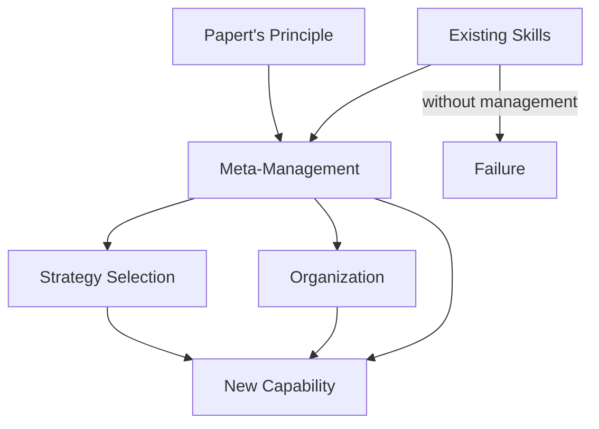

Named after Minsky's colleague Seymour Papert, this principle states that **the most significant advances in mental development come not from learning new skills, but from learning new ways to manage and organize existing skills**. Chapter 10 argues that meta-knowledge — knowing how to use what you know — is more powerful than knowledge itself.

This principle explains why children's cognitive development often proceeds in sudden leaps rather than gradual increments. A child may have all the necessary skills to solve a problem but lack the organizational framework to deploy them effectively. When that framework clicks into place, ability seems to appear overnight.

<!-- beautiful-mermaid comparison -->

  
Meta-Management: Skills + Organization = New Capability

  

<!-- end beautiful-mermaid comparison -->

## Sections

| Section | Title | Link |
|---------|-------|------|
| 10.1 | Papert's Principle | [Read](/read/original/10-papert-principle/) |
| 10.2 | Debugging and Development | [Read](/read/original/10-papert-principle/) |
| 10.3 | The Growth of Competence | [Read](/read/original/10-papert-principle/) |

## Key Themes

- Meta-knowledge as the key to cognitive growth
- Managing existing skills versus acquiring new ones
- Sudden leaps in development
- The role of organization in intelligence

## Related Concepts

- [Agencies](/concepts/agencies/) — organizational structures for agents
- [Agents](/concepts/agents/) — the skills being managed
- [Proto-specialists](/concepts/proto-specialists/) — innate skills that need management

## Read This Chapter

- [Original text](/read/original/10-papert-principle/)
- [Side-by-side companion](/read/side-by-side/10-papert-principle/)
