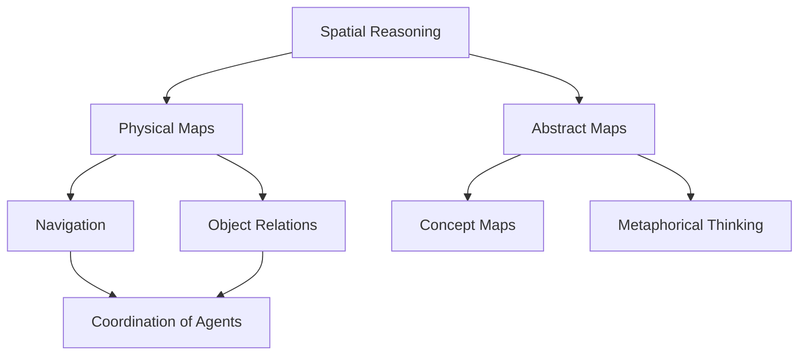

Chapter 11 investigates how we build mental models of space. Minsky argues that spatial reasoning is not a luxury but a fundamental cognitive mechanism. The mental structures we use to navigate physical space are repurposed for abstract thinking — we speak of "higher" ideas, "deep" problems, and "close" relationships because spatial frameworks underlie much of our thought.

The chapter explores how agents coordinate to construct spatial maps, maintain orientation, and reason about objects in three dimensions. These spatial agencies become templates for organizing non-spatial knowledge as well.

<!-- beautiful-mermaid comparison -->

  
Tokyo-night theme (beautiful-mermaid):

  

<!-- end beautiful-mermaid comparison -->

## Sections

| Section | Title | Link |
|---------|-------|------|
| 11.1 | Spatial Awareness | [Read](/read/original/11-the-shape-of-space/) |
| 11.2 | Shape and Perspective | [Read](/read/original/11-the-shape-of-space/) |
| 11.3 | Mental Imagery | [Read](/read/original/11-the-shape-of-space/) |

## Key Themes

- Space as a foundational framework for all thinking
- How spatial agents coordinate to build internal maps
- The reuse of spatial structures for abstract reasoning
- Mental imagery and its role in cognition

## Related Concepts

- [Frames](/concepts/frames/) — spatial frames as templates for knowledge
- [Agencies](/concepts/agencies/) — spatial agencies and their organization
- [Trans-frames](/concepts/trans-frames/) — representing movement through space

## Read This Chapter

- [Original text](/read/original/11-the-shape-of-space/)
- [Side-by-side companion](/read/side-by-side/11-the-shape-of-space/)
