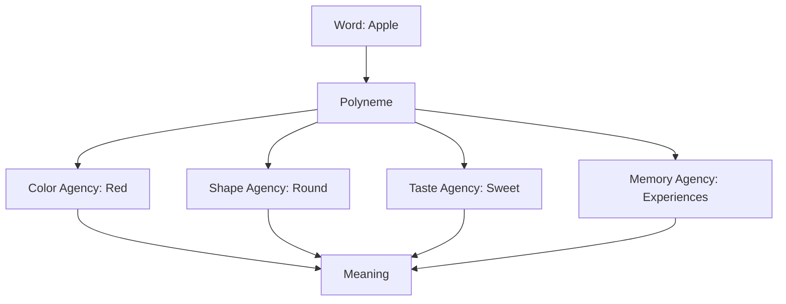

What does it mean for something to have "meaning"? Chapter 12 argues that meaning is not a property of words or symbols in isolation but emerges from the web of connections between agents. To understand a word is to activate a network of related agents — sensory, motor, emotional, and conceptual — that together constitute the meaning of that word.

Minsky introduces the concept of **polynemes** — signals that activate different agents in different agencies, producing a distributed representation. A single word like "apple" activates color agents, shape agents, taste agents, and memory agents simultaneously. Meaning is this entire pattern of activation.

<!-- beautiful-mermaid comparison -->

  
Tokyo-night theme (beautiful-mermaid):

  

<!-- end beautiful-mermaid comparison -->

## Sections

| Section | Title | Link |
|---------|-------|------|
| 12.1 | Meaning and Definition | [Read](/read/original/12-learning-meaning/) |
| 12.2 | Polynemes | [Read](/read/original/12-learning-meaning/) |
| 12.3 | Accumulation of Meaning | [Read](/read/original/12-learning-meaning/) |

## Key Themes

- Meaning as a distributed pattern of activation
- Polynemes and cross-agency signals
- How meaning accumulates through experience
- The impossibility of fixed definitions

## Related Concepts

- [K-lines](/concepts/k-lines/) — memory connections that contribute to meaning
- [Frames](/concepts/frames/) — structured representations that organize meaning
- [Agents](/concepts/agents/) — the units whose activation patterns constitute meaning

## Read This Chapter

- [Original text](/read/original/12-learning-meaning/)
- [Side-by-side companion](/read/side-by-side/12-learning-meaning/)
