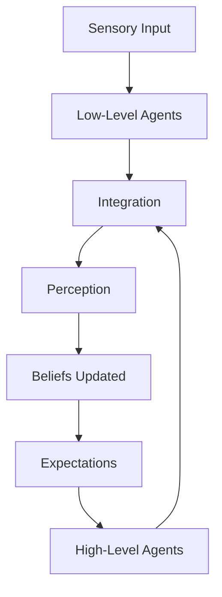

Seeing is not a passive process of recording images. Chapter 13 reveals that perception is deeply constructive: what we "see" is shaped as much by our expectations and beliefs as by the raw sensory data. Agents at every level — from edge detectors to high-level concept recognizers — contribute to the construction of visual experience.

Minsky argues that perception and cognition are inseparable. We see what we expect to see, and our beliefs actively shape our perceptions. This explains optical illusions, perceptual errors, and the remarkable speed with which we recognize familiar scenes.

<!-- beautiful-mermaid comparison -->

  
Perception Loop: Senses + Expectations → Beliefs

  

<!-- end beautiful-mermaid comparison -->

## Sections

| Section | Title | Link |
|---------|-------|------|
| 13.1 | Seeing and Believing | [Read](/read/original/13-seeing-and-believing/) |
| 13.2 | Expectations and Perception | [Read](/read/original/13-seeing-and-believing/) |
| 13.3 | The Role of Knowledge in Seeing | [Read](/read/original/13-seeing-and-believing/) |

## Key Themes

- Perception as active construction, not passive recording
- Top-down influence of expectations on seeing
- The inseparability of perception and cognition
- How beliefs shape what we perceive

## Related Concepts

- [Frames](/concepts/frames/) — expectation structures that guide perception
- [Agents](/concepts/agents/) — perceptual agents at multiple levels
- [K-lines](/concepts/k-lines/) — past experience shaping current perception

## Read This Chapter

- [Original text](/read/original/13-seeing-and-believing/)
- [Side-by-side companion](/read/side-by-side/13-seeing-and-believing/)
