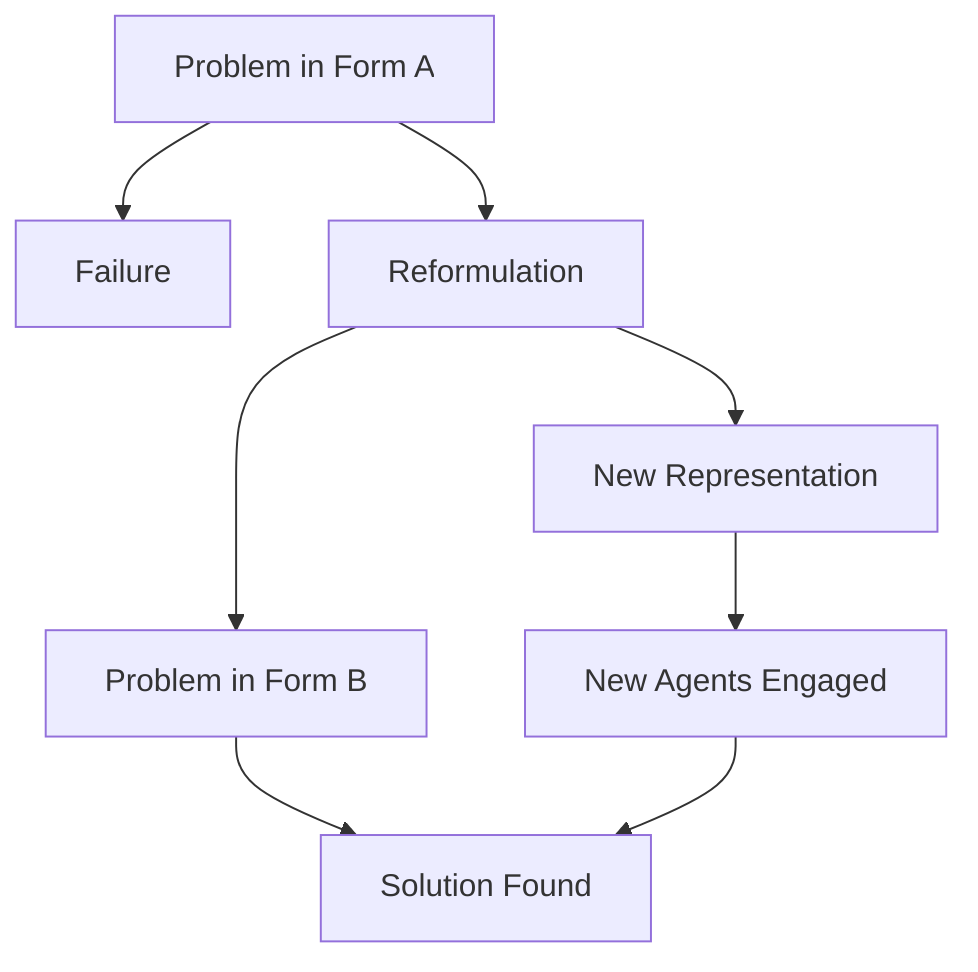

Sometimes the key to solving a problem is not trying harder but looking at it differently. Chapter 14 explores **reformulation** — the mind's ability to re-represent a problem in a new form that makes the solution more accessible. This is one of the most powerful cognitive strategies available.

Minsky shows that many breakthroughs in both everyday problem-solving and scientific discovery come from finding the right representation. A problem that seems impossible in one form may become trivial in another. The agents responsible for reformulation are among the most important — yet least understood — in the society of mind.

<!-- beautiful-mermaid comparison -->

  
Problem Transformation: New Form → New Solution

  

<!-- end beautiful-mermaid comparison -->

## Sections

| Section | Title | Link |
|---------|-------|------|
| 14.1 | Reformulation | [Read](/read/original/14-reformulation/) |
| 14.2 | Finding New Representations | [Read](/read/original/14-reformulation/) |
| 14.3 | The Power of Representation | [Read](/read/original/14-reformulation/) |

## Key Themes

- Reformulation as a key problem-solving strategy
- The power of choosing the right representation
- How changing perspective engages different agents
- Representation and scientific discovery

## Related Concepts

- [Frames](/concepts/frames/) — different frames provide different representations
- [Trans-frames](/concepts/trans-frames/) — transforming between representations
- [Agencies](/concepts/agencies/) — how different agencies see the same problem differently

## Read This Chapter

- [Original text](/read/original/14-reformulation/)
- [Side-by-side companion](/read/side-by-side/14-reformulation/)
