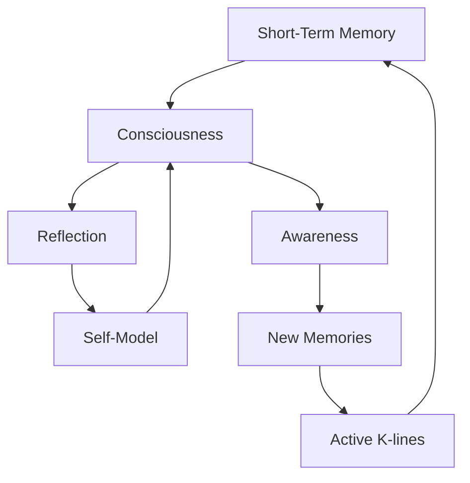

Chapter 15 connects two of the book's major themes: consciousness and memory. Minsky argues that consciousness is deeply intertwined with short-term memory — what we are "conscious of" at any moment is largely determined by which K-lines and agents are currently active and accessible.

The chapter suggests that consciousness is not a special substance or process but a particular pattern of memory activity. We feel conscious of something when our internal models of that thing are active and connected to our self-model. This view demystifies consciousness without diminishing its significance.

## Sections

| Section | Title | Link |
|---------|-------|------|
| 15.1 | Consciousness | [Read](/read/original/15-consciousness-and-memory/) |
| 15.2 | Levels of Awareness | [Read](/read/original/15-consciousness-and-memory/) |
| 15.3 | Memory and Consciousness | [Read](/read/original/15-consciousness-and-memory/) |

## Key Themes

- Consciousness as a pattern of memory activity
- The role of short-term memory in awareness
- Self-models and reflective consciousness
- Demystifying consciousness within the agent framework

## Related Concepts

- [Consciousness](/concepts/consciousness/) — the central concept explored here
- [K-lines](/concepts/k-lines/) — memory structures underlying conscious experience
- [Agents](/concepts/agents/) — the active agents that constitute awareness

## Read This Chapter

- [Original text](/read/original/15-consciousness-and-memory/)
- [Side-by-side companion](/read/side-by-side/15-consciousness-and-memory/)
