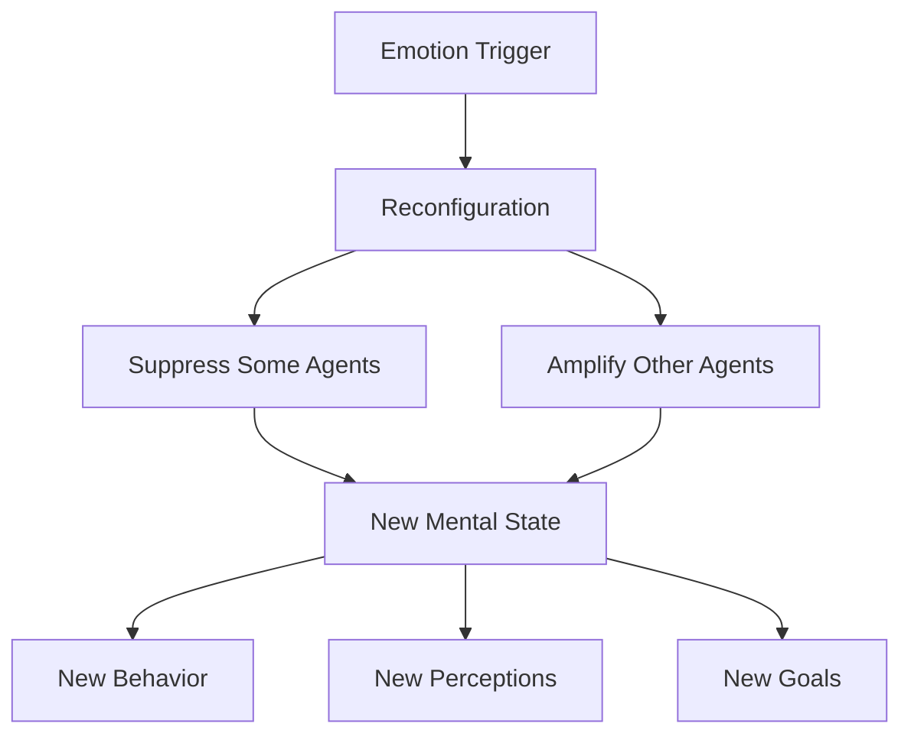

Are emotions the opposite of rational thought? Minsky says no. Chapter 16 reframes emotions as **different ways of thinking** rather than disruptions of thinking. An emotion like anger does not shut down cognition — it reconfigures which agents are active, changing priorities, strategies, and perceptions all at once.

Emotions function as large-scale control signals that rapidly reorganize the society of mind. When you feel fear, certain agencies are suppressed while others are amplified. This wholesale reconfiguration is what gives emotions their distinctive feel and their power to transform behavior instantly.

## Sections

| Section | Title | Link |
|---------|-------|------|
| 16.1 | Emotion | [Read](/read/original/16-emotion/) |
| 16.2 | Mental States and Dispositions | [Read](/read/original/16-emotion/) |
| 16.3 | The Emotional Landscape | [Read](/read/original/16-emotion/) |

## Key Themes

- Emotions as ways of thinking, not opposites of thought
- Large-scale reconfiguration of agent activity
- How emotions change goals, perceptions, and strategies
- The functional value of emotional states

## Related Concepts

- [Agents](/concepts/agents/) — agents are reconfigured by emotional states
- [Censors](/concepts/censors/) — emotional censoring of unwanted thoughts
- [Consciousness](/concepts/consciousness/) — emotional states and conscious experience

## Read This Chapter

- [Original text](/read/original/16-emotion/)
- [Side-by-side companion](/read/side-by-side/16-emotion/)
