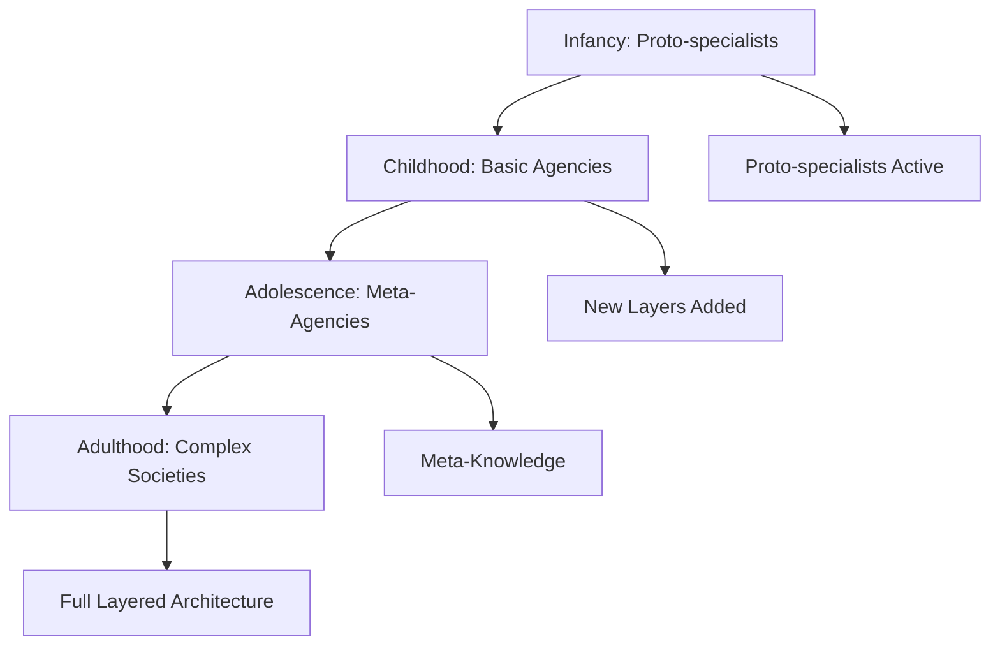

Chapter 17 traces how the society of mind develops from infancy through adulthood. Minsky draws on developmental psychology — particularly the work of Piaget — to show how cognitive growth involves building new layers of agents on top of existing ones, creating increasingly sophisticated mental architectures.

Development is not a smooth process but one marked by reorganizations where old strategies are replaced or augmented by new meta-level management. Each stage of development adds new agencies that can oversee and coordinate the work of agencies built at earlier stages.

## Sections

| Section | Title | Link |
|---------|-------|------|
| 17.1 | Development | [Read](/read/original/17-development/) |
| 17.2 | Attachment and Goals | [Read](/read/original/17-development/) |
| 17.3 | Developmental Stages | [Read](/read/original/17-development/) |

## Key Themes

- Cognitive development as layered construction
- The role of proto-specialists in early development
- Stage-like reorganizations of mental architecture
- Papert's Principle in child development

## Related Concepts

- [Proto-specialists](/concepts/proto-specialists/) — innate agents active from birth
- [Agencies](/concepts/agencies/) — new agencies built during development
- [K-lines](/concepts/k-lines/) — experience-based learning over time

## Read This Chapter

- [Original text](/read/original/17-development/)
- [Side-by-side companion](/read/side-by-side/17-development/)
