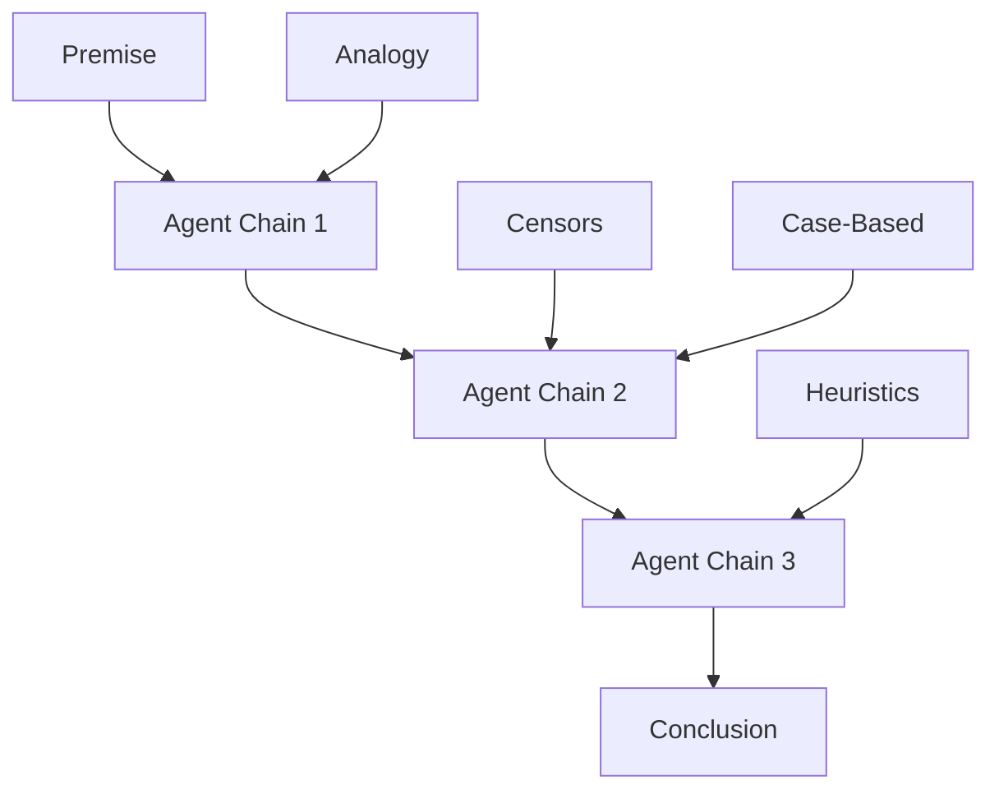

How does the mind reason? Chapter 18 argues that logical reasoning is not a fundamental operation of mind but a specialized skill built from more primitive agent interactions. Most of our everyday reasoning is not formal logic but a mixture of analogy, case-based reasoning, and heuristic shortcuts.

Minsky shows that what we call "reasoning" involves chains of agents triggering one another in sequences, with each step constrained by various censors and critics. Formal logic is a recent cultural invention layered on top of much older and more powerful (but less reliable) reasoning mechanisms.

## Sections

| Section | Title | Link |
|---------|-------|------|
| 18.1 | Reasoning | [Read](/read/original/18-reasoning/) |
| 18.2 | Chains of Reasoning | [Read](/read/original/18-reasoning/) |
| 18.3 | Logic and Analogy | [Read](/read/original/18-reasoning/) |

## Key Themes

- Reasoning as agent coordination, not formal logic
- Chains of activation between agents
- Analogy and case-based reasoning as primary mechanisms
- The role of censors in controlling reasoning

## Related Concepts

- [Agents](/concepts/agents/) — the links in chains of reasoning
- [Censors](/concepts/censors/) — critics that constrain reasoning steps
- [Trans-frames](/concepts/trans-frames/) — tracking transformations in reasoning

## Read This Chapter

- [Original text](/read/original/18-reasoning/)
- [Side-by-side companion](/read/side-by-side/18-reasoning/)
