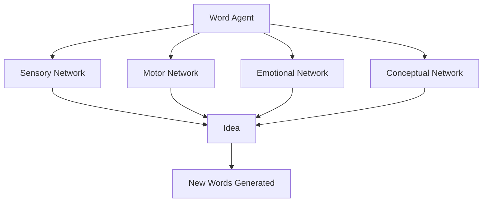

Chapter 19 explores the deep connection between words and ideas. Minsky argues that words are not mere labels attached to pre-existing concepts. Instead, words function as agents themselves — each word, when activated, triggers a complex network of other agents that collectively constitute the "idea" the word represents.

This view challenges the common assumption that thought precedes language. In Minsky's framework, language and thought are deeply intertwined: words help organize thoughts, and the structure of language shapes the structure of thinking. Learning new words is not just learning labels but acquiring new mental tools.

<!-- beautiful-mermaid comparison -->

  
Word-Idea Networks: Words Activate Multi-network Ideas

  

<!-- end beautiful-mermaid comparison -->

## Sections

| Section | Title | Link |
|---------|-------|------|
| 19.1 | Words and Ideas | [Read](/read/original/19-words-and-ideas/) |
| 19.2 | Language as a Tool for Thought | [Read](/read/original/19-words-and-ideas/) |
| 19.3 | The Power of Naming | [Read](/read/original/19-words-and-ideas/) |

## Key Themes

- Words as agents that activate idea networks
- The intertwining of language and thought
- How vocabulary shapes cognitive capability
- Language as a mental tool, not just communication

## Related Concepts

- [Agents](/concepts/agents/) — words as a special class of agents
- [K-lines](/concepts/k-lines/) — words activating memory networks
- [Frames](/concepts/frames/) — linguistic frames that structure meaning

## Read This Chapter

- [Original text](/read/original/19-words-and-ideas/)
- [Side-by-side companion](/read/side-by-side/19-words-and-ideas/)
