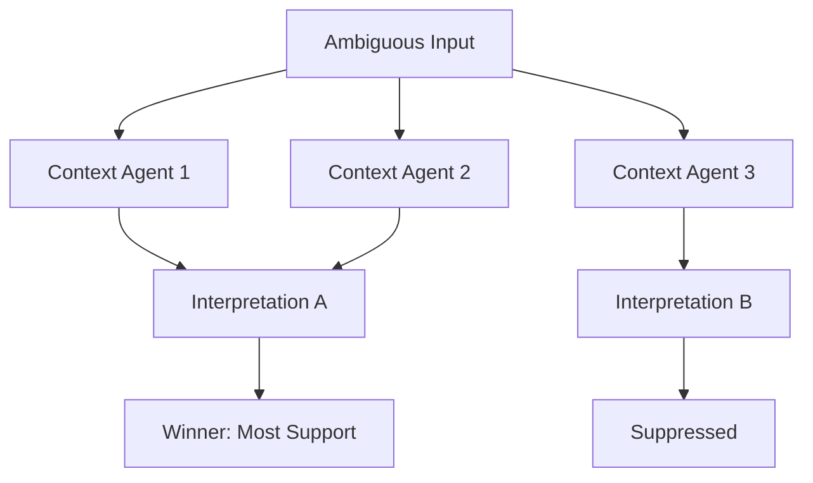

Almost every word, sentence, and perception is ambiguous — yet we rarely notice. Chapter 20 examines how the mind uses context to resolve ambiguity so quickly and effectively that we are usually unaware it is happening. Context is not a single thing but a collection of active agents that bias interpretation in particular directions.

Minsky shows that ambiguity resolution is a fundamental cognitive operation, not a special linguistic process. The same mechanisms that disambiguate words also help us interpret visual scenes, social situations, and abstract concepts. Context works by priming certain agents and suppressing others.

## Sections

| Section | Title | Link |
|---------|-------|------|
| 20.1 | Context and Ambiguity | [Read](/read/original/20-context-and-ambiguity/) |
| 20.2 | Contextual Priming | [Read](/read/original/20-context-and-ambiguity/) |
| 20.3 | Resolving Conflicts | [Read](/read/original/20-context-and-ambiguity/) |

## Key Themes

- Pervasive ambiguity in language and perception
- Context as a collection of biasing agents
- Rapid, unconscious disambiguation
- The universality of context-dependent processing

## Related Concepts

- [Frames](/concepts/frames/) — context-setting structures
- [Censors](/concepts/censors/) — suppressing inappropriate interpretations
- [K-lines](/concepts/k-lines/) — prior experience providing context

## Read This Chapter

- [Original text](/read/original/20-context-and-ambiguity/)
- [Side-by-side companion](/read/side-by-side/20-context-and-ambiguity/)
