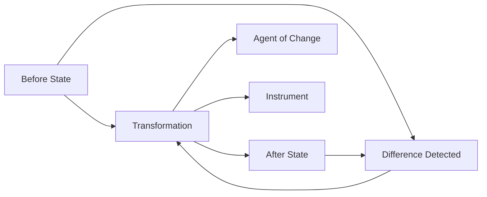

How does the mind represent change? Chapter 21 introduces **trans-frames** — mental structures designed to represent transitions from one state to another. A trans-frame captures a before-state, an after-state, and the action or transformation that connects them.

Trans-frames are essential for understanding causation, planning actions, and making predictions. When you see a ball thrown, a trans-frame represents the ball's departure, trajectory, and arrival. Minsky argues that trans-frames are among the most versatile structures in the mind, underlying our understanding of verbs, stories, and physical processes.

## Sections

| Section | Title | Link |
|---------|-------|------|
| 21.1 | Trans-Frames | [Read](/read/original/21-trans-frames/) |
| 21.2 | Cause and Effect | [Read](/read/original/21-trans-frames/) |
| 21.3 | Actions and Transformations | [Read](/read/original/21-trans-frames/) |

## Key Themes

- Trans-frames as before/after/action structures
- Representing causation and change
- The role of trans-frames in verb understanding
- Predictions based on transformation patterns

## Related Concepts

- [Trans-frames](/concepts/trans-frames/) — the concept explored in depth here
- [Frames](/concepts/frames/) — the general frame theory that trans-frames extend
- [Agencies](/concepts/agencies/) — agencies that detect and represent change

## Read This Chapter

- [Original text](/read/original/21-trans-frames/)
- [Side-by-side companion](/read/side-by-side/21-trans-frames/)
