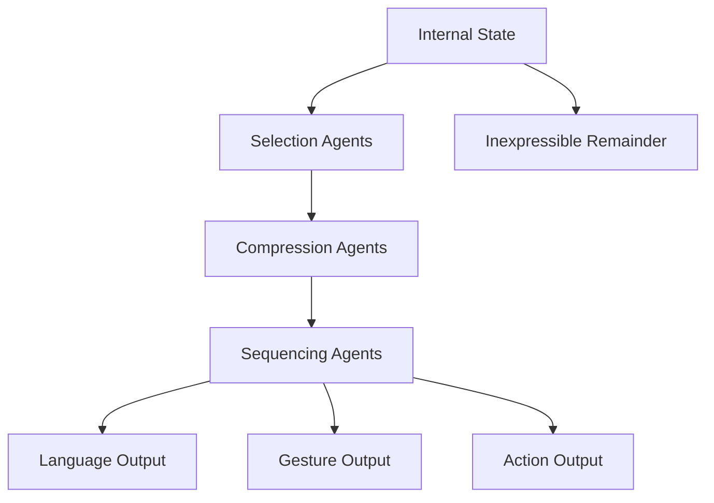

Chapter 22 examines the process of expression — how the mind translates internal mental states into external forms like speech, writing, gesture, and action. Expression is not a simple readout of internal states but a complex process involving selection, compression, and transformation.

Minsky argues that expressing a thought requires an entire secondary society of agents dedicated to packaging ideas for communication. These expression agents must choose what to include, what to leave out, and how to sequence information for the audience. The gap between what we think and what we can express reveals the complexity of this process.

<!-- beautiful-mermaid comparison -->

  
Tokyo-night theme (beautiful-mermaid):

  

<!-- end beautiful-mermaid comparison -->

## Sections

| Section | Title | Link |
|---------|-------|------|
| 22.1 | Expression | [Read](/read/original/22-expression/) |
| 22.2 | The Process of Communication | [Read](/read/original/22-expression/) |
| 22.3 | The Limits of Expression | [Read](/read/original/22-expression/) |

## Key Themes

- Expression as a complex multi-agent process
- The gap between thought and expression
- Selection and compression in communication
- How expression shapes thought itself

## Related Concepts

- [Agents](/concepts/agents/) — expression agents as a specialized class
- [Frames](/concepts/frames/) — communication frames that structure expression
- [Trans-frames](/concepts/trans-frames/) — expressing changes and actions

## Read This Chapter

- [Original text](/read/original/22-expression/)
- [Side-by-side companion](/read/side-by-side/22-expression/)
