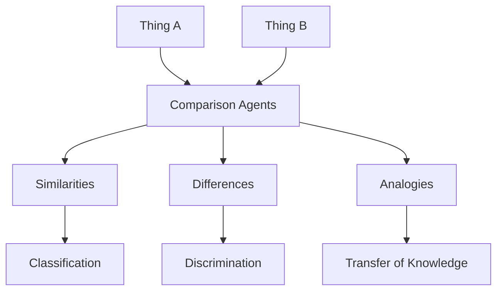

Comparison is one of the mind's most powerful operations. Chapter 23 explores how the ability to detect similarities and differences between things underlies nearly every cognitive function — from perception to learning to reasoning. Minsky argues that comparison is not a single process but involves multiple agents working in parallel across different dimensions.

Analogy, a sophisticated form of comparison, allows the mind to apply knowledge from one domain to another. This cross-domain mapping is central to creative thinking, scientific discovery, and everyday problem-solving. The chapter shows how comparison agents coordinate with frames to identify structural similarities.

<!-- beautiful-mermaid comparison -->

  
Tokyo-night theme (beautiful-mermaid):

  

<!-- end beautiful-mermaid comparison -->

## Sections

| Section | Title | Link |
|---------|-------|------|
| 23.1 | Comparisons | [Read](/read/original/23-comparisons/) |
| 23.2 | Analogy | [Read](/read/original/23-comparisons/) |
| 23.3 | Similarity and Difference | [Read](/read/original/23-comparisons/) |

## Key Themes

- Comparison as a fundamental cognitive operation
- Multi-dimensional similarity and difference detection
- Analogy as cross-domain mapping
- The role of comparison in learning and creativity

## Related Concepts

- [Frames](/concepts/frames/) — structures that enable structural comparison
- [Trans-frames](/concepts/trans-frames/) — comparing before and after states
- [K-lines](/concepts/k-lines/) — memory providing basis for comparison

## Read This Chapter

- [Original text](/read/original/23-comparisons/)
- [Side-by-side companion](/read/side-by-side/23-comparisons/)
