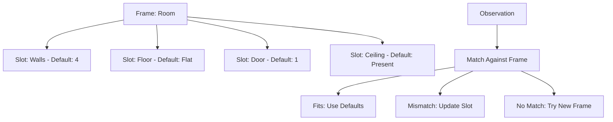

Chapter 24 presents one of Minsky's most influential contributions to artificial intelligence: **frame theory**. A frame is a data structure for representing a stereotyped situation — like being in a room, attending a birthday party, or seeing a face. Each frame has slots for the expected components, filled with default values that can be overridden by actual observations.

Frames explain how we can understand new situations so quickly: we match incoming information against stored frames, fill in missing details with defaults, and are surprised only when expectations are violated. This chapter connects frame theory to the broader society of mind architecture.

## Sections

| Section | Title | Link |
|---------|-------|------|
| 24.1 | Frames | [Read](/read/original/24-frames/) |
| 24.2 | Default Values and Expectations | [Read](/read/original/24-frames/) |
| 24.3 | Frames and Understanding | [Read](/read/original/24-frames/) |

## Key Themes

- Frames as structured knowledge representations
- Default values and expectation-driven processing
- How frames enable rapid understanding of new situations
- The relationship between frames and agents

## Related Concepts

- [Frames](/concepts/frames/) — the concept explored in full depth here
- [Trans-frames](/concepts/trans-frames/) — frames specialized for representing change
- [K-lines](/concepts/k-lines/) — memory connections that activate frames

## Read This Chapter

- [Original text](/read/original/24-frames/)
- [Side-by-side companion](/read/side-by-side/24-frames/)
