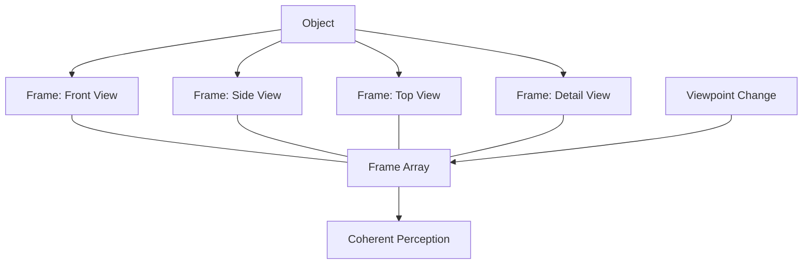

A single frame represents one view of a situation, but real understanding requires seeing things from multiple perspectives. Chapter 25 introduces **frame arrays** — organized collections of frames that represent the same object or scene from different viewpoints and at different levels of detail.

When you walk around a building, your mind does not create a new representation from scratch at each step. Instead, a frame array links together the frames for each viewpoint, allowing smooth transitions as perspective changes. This mechanism explains how we maintain a coherent sense of objects despite constantly changing sensory input.

<!-- beautiful-mermaid comparison -->

  
Tokyo-night theme (beautiful-mermaid):

  

<!-- end beautiful-mermaid comparison -->

## Sections

| Section | Title | Link |
|---------|-------|------|
| 25.1 | Frame Arrays | [Read](/read/original/25-frame-arrays/) |
| 25.2 | Perspective and Viewpoint | [Read](/read/original/25-frame-arrays/) |
| 25.3 | Coherent Representation | [Read](/read/original/25-frame-arrays/) |

## Key Themes

- Frame arrays as multi-perspective representations
- Smooth transitions between viewpoints
- Object constancy despite changing input
- The relationship between frames and spatial reasoning

## Related Concepts

- [Frames](/concepts/frames/) — the individual frames that compose arrays
- [Trans-frames](/concepts/trans-frames/) — transitions between frame perspectives
- [Agencies](/concepts/agencies/) — the agencies that manage frame arrays

## Read This Chapter

- [Original text](/read/original/25-frame-arrays/)
- [Side-by-side companion](/read/side-by-side/25-frame-arrays/)
