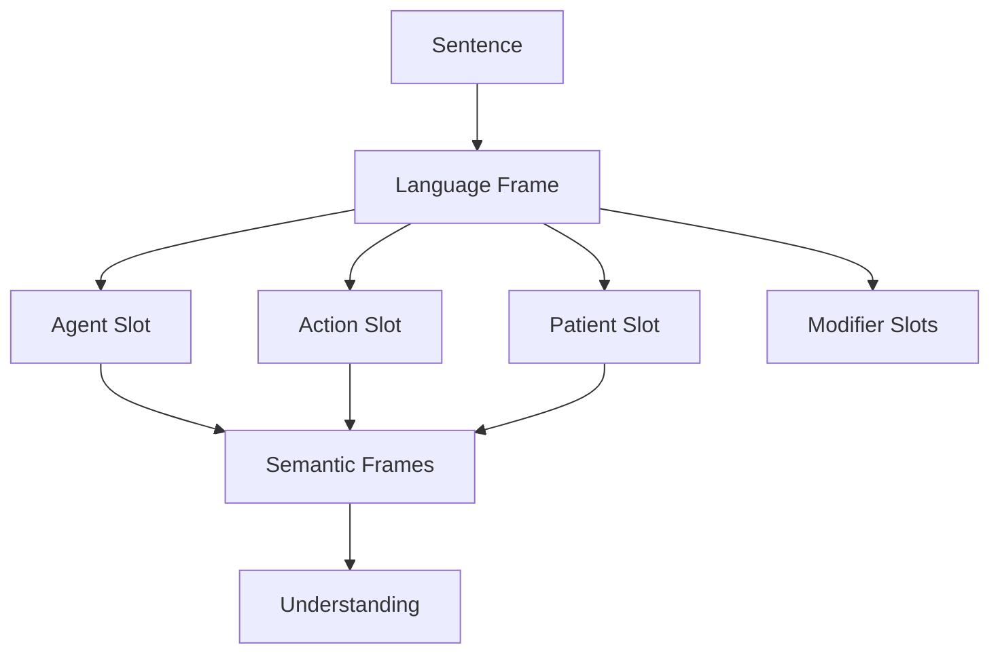

Chapter 26 extends frame theory to language. Minsky proposes that we understand sentences by fitting them into **language frames** — structured templates with slots for subjects, actions, objects, and modifiers. These frames are not merely syntactic patterns but carry semantic expectations that guide comprehension.

When you hear "The dog chased the cat," a language frame is activated with slots for agent, action, and patient. The frame carries expectations: the agent is active, the patient is affected, and the action implies movement. Language frames connect linguistic structure to the broader frame-based knowledge representation system.

<!-- beautiful-mermaid comparison -->

  
Sentence Frames: Structure Slots → Semantic Understanding

  

<!-- end beautiful-mermaid comparison -->

## Sections

| Section | Title | Link |
|---------|-------|------|
| 26.1 | Language Frames | [Read](/read/original/26-language-frames/) |
| 26.2 | Sentence Structure as Frames | [Read](/read/original/26-language-frames/) |
| 26.3 | Grammar and Meaning | [Read](/read/original/26-language-frames/) |

## Key Themes

- Sentences as frame structures with semantic slots
- How language frames carry expectations
- The connection between syntax and meaning
- Language understanding as frame matching

## Related Concepts

- [Frames](/concepts/frames/) — the general theory applied to language
- [Trans-frames](/concepts/trans-frames/) — verbs as trans-frame activators
- [K-lines](/concepts/k-lines/) — stored language patterns

## Read This Chapter

- [Original text](/read/original/26-language-frames/)
- [Side-by-side companion](/read/side-by-side/26-language-frames/)
