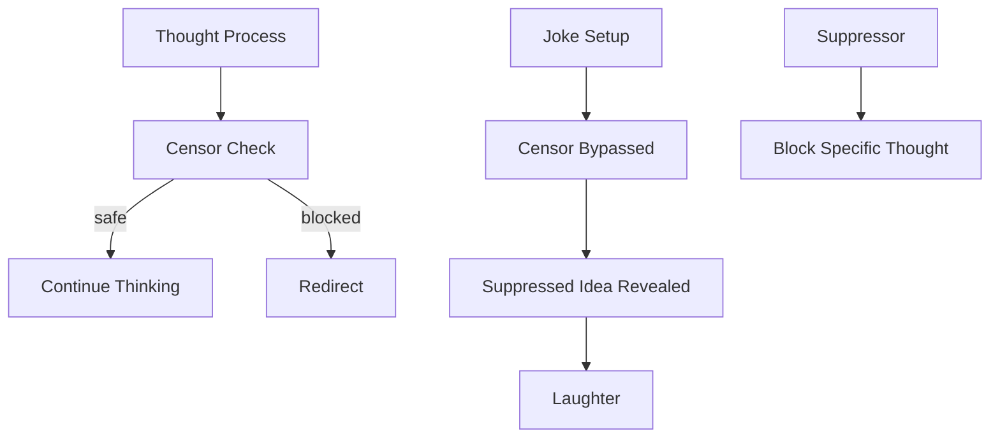

Chapter 27 introduces **censors** and **suppressors** — agents whose job is to prevent the mind from pursuing known bad ideas. Censors detect when thinking is heading toward a previously identified mistake and intervene to redirect it. Suppressors block specific thoughts or actions that have been learned to be unproductive.

In a surprising turn, Minsky connects censorship to humor. He argues that jokes work by leading the mind past a censor — you are guided toward a forbidden or "wrong" interpretation, and the sudden recognition of the suppressed idea produces laughter. Humor reveals the hidden architecture of mental censorship.

<!-- beautiful-mermaid comparison -->

  
Tokyo-night theme (beautiful-mermaid):

  

<!-- end beautiful-mermaid comparison -->

## Sections

| Section | Title | Link |
|---------|-------|------|
| 27.1 | Censors and Suppressors | [Read](/read/original/27-censors-and-jokes/) |
| 27.2 | Jokes and Humor | [Read](/read/original/27-censors-and-jokes/) |
| 27.3 | The Value of Negative Knowledge | [Read](/read/original/27-censors-and-jokes/) |

## Key Themes

- Censors as agents that prevent known mistakes
- Suppressors that block specific unproductive thoughts
- Humor as censor bypass
- The importance of "negative knowledge"

## Related Concepts

- [Censors](/concepts/censors/) — the concept explored in full depth here
- [Agents](/concepts/agents/) — censors as a specialized agent type
- [Consciousness](/concepts/consciousness/) — unconscious censoring processes

## Read This Chapter

- [Original text](/read/original/27-censors-and-jokes/)
- [Side-by-side companion](/read/side-by-side/27-censors-and-jokes/)
