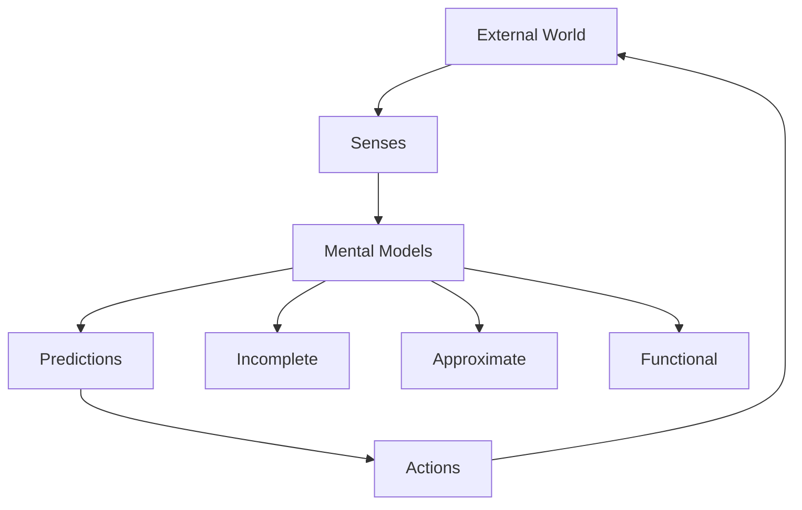

Chapter 28 explores the boundary between mind and world. Minsky argues that the mind never directly contacts reality — instead, it builds internal models that represent aspects of the external world. These models are not copies of reality but functional approximations built from agent interactions.

The chapter raises profound questions about the relationship between representation and reality. Our mental models are always incomplete, sometimes wrong, and inevitably shaped by the architecture of our particular society of mind. Yet these imperfect models are sufficient to let us navigate, predict, and act in the world with remarkable success.

## Sections

| Section | Title | Link |
|---------|-------|------|
| 28.1 | The Mind and the World | [Read](/read/original/28-the-mind-and-the-world/) |
| 28.2 | Mental Models | [Read](/read/original/28-the-mind-and-the-world/) |
| 28.3 | The Limits of Representation | [Read](/read/original/28-the-mind-and-the-world/) |

## Key Themes

- Mental models as functional approximations of reality
- The gap between representation and reality
- How imperfect models enable effective action
- The constructive nature of perception and knowledge

## Related Concepts

- [Frames](/concepts/frames/) — the structures that compose mental models
- [Agents](/concepts/agents/) — the builders and users of models
- [Consciousness](/concepts/consciousness/) — awareness of our models, not of reality itself

## Read This Chapter

- [Original text](/read/original/28-the-mind-and-the-world/)
- [Side-by-side companion](/read/side-by-side/28-the-mind-and-the-world/)
