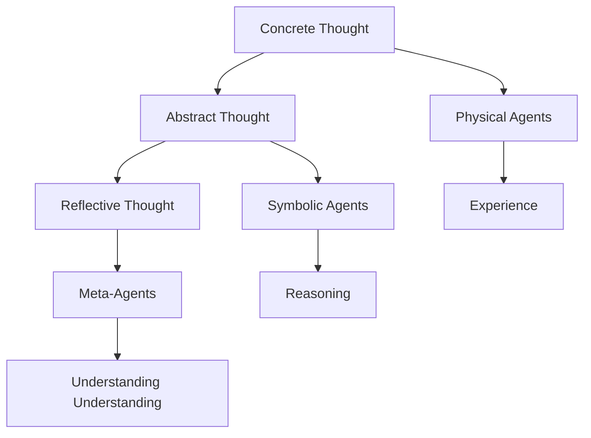

Chapter 29 maps the different "realms" or modes of thinking available to the society of mind. Minsky distinguishes between concrete thought (tied to physical experience), abstract thought (operating on symbols and relationships), and reflective thought (thinking about thinking itself).

These realms are not separate compartments but overlapping territories managed by different agencies. The mind's ability to move between realms — from handling a physical object to reasoning about its properties to reflecting on the reasoning process — is one of its most distinctive capabilities. Each realm engages different agents and different frame systems.

## Sections

| Section | Title | Link |
|---------|-------|------|
| 29.1 | The Realms of Thought | [Read](/read/original/29-the-realms-of-thought/) |
| 29.2 | Levels of Abstraction | [Read](/read/original/29-the-realms-of-thought/) |
| 29.3 | Reflective Thinking | [Read](/read/original/29-the-realms-of-thought/) |

## Key Themes

- Multiple modes of thinking: concrete, abstract, reflective
- Moving between realms as a cognitive skill
- Different agent types for different thinking modes
- Meta-cognition and self-reflection

## Related Concepts

- [Agents](/concepts/agents/) — different agents for different realms
- [Frames](/concepts/frames/) — realm-specific frame systems
- [Consciousness](/concepts/consciousness/) — reflective thought and self-awareness

## Read This Chapter

- [Original text](/read/original/29-the-realms-of-thought/)
- [Side-by-side companion](/read/side-by-side/29-the-realms-of-thought/)
