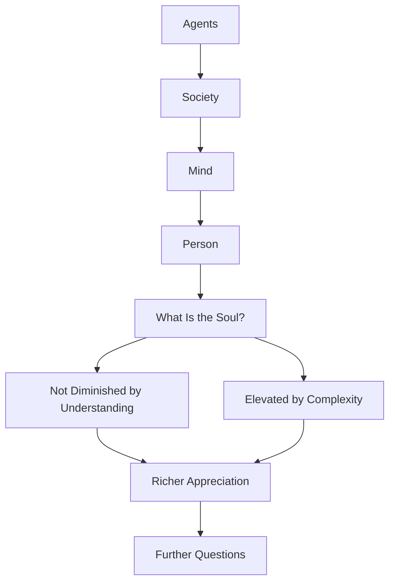

The final chapter brings the book full circle. Having built up a detailed picture of the mind as a society of interacting agents, Minsky confronts the deepest question: what about the soul? If minds are just collections of mindless agents, does that diminish us?

Minsky argues the opposite. Understanding how minds work does not reduce us — it reveals the extraordinary richness and complexity of what we are. The soul is not diminished by being understood as a society; rather, the society of mind is elevated by producing something as remarkable as a person. The chapter ends with an invitation to continue exploring.

## Sections

| Section | Title | Link |
|---------|-------|------|
| 30.1 | The Soul | [Read](/read/original/30-the-soul/) |
| 30.2 | What Minds Are Made Of | [Read](/read/original/30-the-soul/) |
| 30.3 | The Society and the Self | [Read](/read/original/30-the-soul/) |

## Key Themes

- The soul as an emergent property of the society of mind
- Understanding does not diminish meaning
- The remarkable complexity of what we are
- Open questions and invitations for further exploration

## Related Concepts

- [Consciousness](/concepts/consciousness/) — the subjective experience of being a society of agents
- [Agents](/concepts/agents/) — the building blocks that compose the soul
- [Agencies](/concepts/agencies/) — the organized structures that produce personhood

## Read This Chapter

- [Original text](/read/original/30-the-soul/)
- [Side-by-side companion](/read/side-by-side/30-the-soul/)
