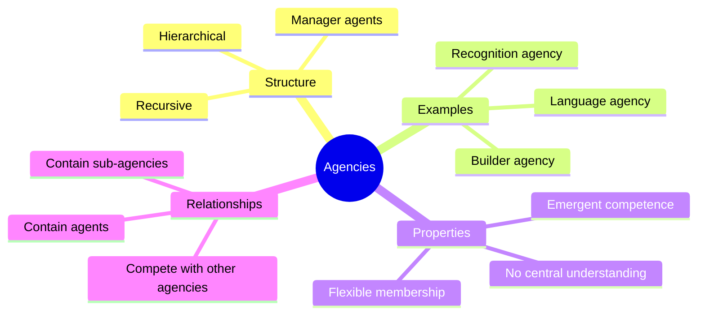

An **agency** is a group of agents organized to accomplish a specific function. While each agent in the group is simple and mindless, the agency as a whole can perform complex tasks like building a tower, recognizing a face, or parsing a sentence. Agencies are the mid-level organizational unit in the society of mind — larger than individual agents but smaller than the mind itself.

Agencies are typically organized hierarchically: a top-level agent manages the agency by activating and suppressing its member agents. But Minsky emphasizes that the manager agent does not "understand" the task — it merely coordinates signals. The intelligence of the agency emerges from the pattern of interactions, not from any single executive.

Agencies can contain sub-agencies, creating a recursive structure. The "Builder" agency might contain "Find," "Grasp," and "Place" sub-agencies, each of which has its own internal agents. This hierarchical, recursive organization allows the mind to handle tasks of arbitrary complexity.

## Where This Appears

| Chapter | Context |
|---------|---------|
| [Ch. 1: Building Blocks](/chapters/01-building-blocks/overview/) | The Builder agency as example |
| [Ch. 2: Wholes and Parts](/chapters/02-wholes-and-parts/overview/) | Agencies as functional wholes |
| [Ch. 3: Conflict and Compromise](/chapters/03-conflict-and-compromise/overview/) | Agencies in hierarchical control |
| [Ch. 7: Problems and Goals](/chapters/07-problems-and-goals/overview/) | Agencies as goal-pursuing units |
| [Ch. 10: Papert's Principle](/chapters/10-papert-principle/overview/) | Managing agencies with meta-agencies |
| [Ch. 17: Development](/chapters/17-development/overview/) | Building new agencies over time |

## Related Concepts

- [Agents](/concepts/agents/) — the simple units that compose agencies
- [Proto-specialists](/concepts/proto-specialists/) — innate agencies present from birth
- [Frames](/concepts/frames/) — knowledge structures that agencies use
- [Consciousness](/concepts/consciousness/) — which agencies have access to awareness
