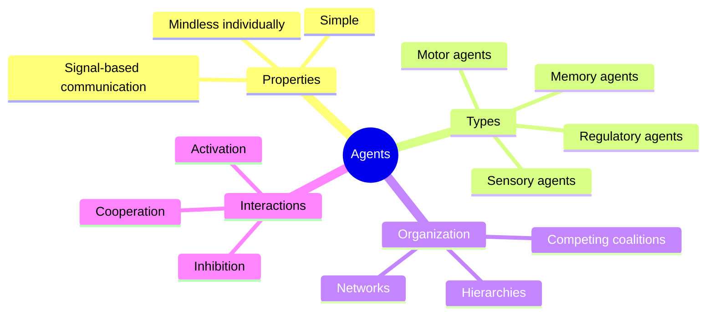

An **agent** is the smallest functional unit in Minsky's theory. Each agent is a simple process that performs one tiny task — detecting an edge, activating a muscle, or signaling a match. No single agent is intelligent, creative, or conscious. Intelligence emerges only from the interaction of many agents working together.

Agents communicate through simple signals: they can activate or inhibit other agents, and they can be organized into hierarchies, networks, and competing coalitions. The power of the society of mind comes not from the sophistication of individual agents but from the richness of their interconnections.

Minsky draws an analogy to neurons in the brain: each neuron is a relatively simple device, yet billions of them connected together produce thought, perception, and feeling. Similarly, agents are mindless parts that collectively give rise to a mind.

## Where This Appears

| Chapter | Context |
|---------|---------|
| [Ch. 1: Building Blocks](/chapters/01-building-blocks/overview/) | Agents introduced as fundamental units |
| [Ch. 2: Wholes and Parts](/chapters/02-wholes-and-parts/overview/) | How agents compose into wholes |
| [Ch. 3: Conflict and Compromise](/chapters/03-conflict-and-compromise/overview/) | Agents in competition |
| [Ch. 7: Problems and Goals](/chapters/07-problems-and-goals/overview/) | Agents pursuing sub-goals |
| [Ch. 16: Emotion](/chapters/16-emotion/overview/) | Emotional reconfiguration of agents |
| [Ch. 30: The Soul](/chapters/30-the-soul/overview/) | Agents as the substance of mind |

## Related Concepts

- [Agencies](/concepts/agencies/) — organized groups of agents
- [Proto-specialists](/concepts/proto-specialists/) — innate, built-in agents
- [K-lines](/concepts/k-lines/) — connections between agents that serve as memory
- [Censors](/concepts/censors/) — agents specialized for preventing mistakes
