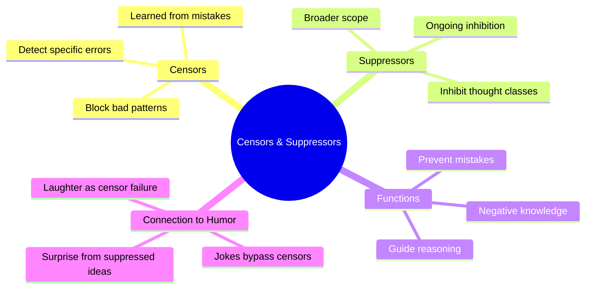

**Censors** and **suppressors** are specialized agents responsible for self-regulation within the society of mind. Their job is to prevent the mind from repeating known mistakes by detecting when thinking is heading in an unproductive direction and intervening to redirect it.

A **censor** monitors the outputs of other agents and blocks those that match patterns of previously identified errors. If you once burned your hand by touching a hot stove, a censor learned from that experience will activate when you consider touching a hot surface again, preventing the action before it occurs.

A **suppressor** works more broadly, inhibiting entire classes of thought or behavior. While censors react to specific situations, suppressors maintain ongoing inhibition of certain patterns. Together, they constitute the mind's "negative knowledge" — knowledge about what *not* to do, which Minsky argues is just as important as knowledge about what to do.

Minsky connects censorship to humor: jokes work by leading the mind past a censor, allowing a suppressed idea to surface unexpectedly. The surprise of seeing the forbidden thought is what produces laughter.

## Where This Appears

| Chapter | Context |
|---------|---------|
| [Ch. 3: Conflict and Compromise](/chapters/03-conflict-and-compromise/overview/) | Suppression as conflict resolution |
| [Ch. 7: Problems and Goals](/chapters/07-problems-and-goals/overview/) | Censors blocking unproductive goals |
| [Ch. 18: Reasoning](/chapters/18-reasoning/overview/) | Censors constraining reasoning chains |
| [Ch. 27: Censors and Jokes](/chapters/27-censors-and-jokes/overview/) | Full treatment of censors and humor |

## Related Concepts

- [Agents](/concepts/agents/) — censors and suppressors are specialized agents
- [Agencies](/concepts/agencies/) — regulatory agencies built from censors
- [Consciousness](/concepts/consciousness/) — censors mostly work unconsciously
- [Frames](/concepts/frames/) — frames that trigger censor activation
