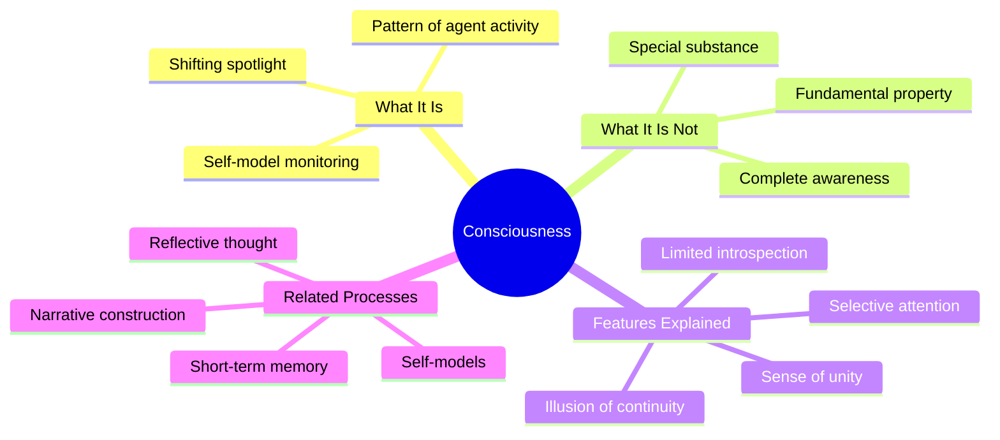

**Consciousness**, in Minsky's framework, is not a special substance or a fundamental property of mind. Instead, it is a particular pattern of activity within the society of mind — specifically, the activity of agents that model and monitor other agents. We feel "conscious" of something when our self-model is actively representing it and connected to our current processing.

Minsky argues that the sense of a unified consciousness is an illusion produced by the architecture of the mind. At any moment, only a small subset of agents is "in the spotlight" of awareness. The rest of the mind's vast activity occurs unconsciously. What we call consciousness is more like a shifting spotlight than a comprehensive awareness.

This view explains several puzzling features of consciousness. We cannot introspect on most of our mental processes because they occur below the level that the self-model monitors. We experience consciousness as continuous even though it is constantly shifting because the self-model smooths over the transitions. And we feel like a single unified self even though we are many agents because the self-model presents a simplified, coherent narrative.

Minsky does not claim to fully solve the "hard problem" of consciousness, but he offers a framework for understanding many of its features without appealing to mysterious or non-physical explanations.

## Where This Appears

| Chapter | Context |
|---------|---------|
| [Ch. 4: The Self](/chapters/04-the-self/overview/) | The self as constructed, not given |
| [Ch. 6: Insight and Introspection](/chapters/06-insight-and-introspection/overview/) | Limits of conscious self-knowledge |
| [Ch. 15: Consciousness and Memory](/chapters/15-consciousness-and-memory/overview/) | Consciousness and memory intertwined |
| [Ch. 29: The Realms of Thought](/chapters/29-the-realms-of-thought/overview/) | Reflective consciousness |
| [Ch. 30: The Soul](/chapters/30-the-soul/overview/) | Consciousness and the nature of persons |

## Related Concepts

- [Agents](/concepts/agents/) — the many unconscious agents behind awareness
- [K-lines](/concepts/k-lines/) — memory structures underlying conscious experience
- [Censors](/concepts/censors/) — unconscious regulators of thought
- [Frames](/concepts/frames/) — the structured content of conscious experience
