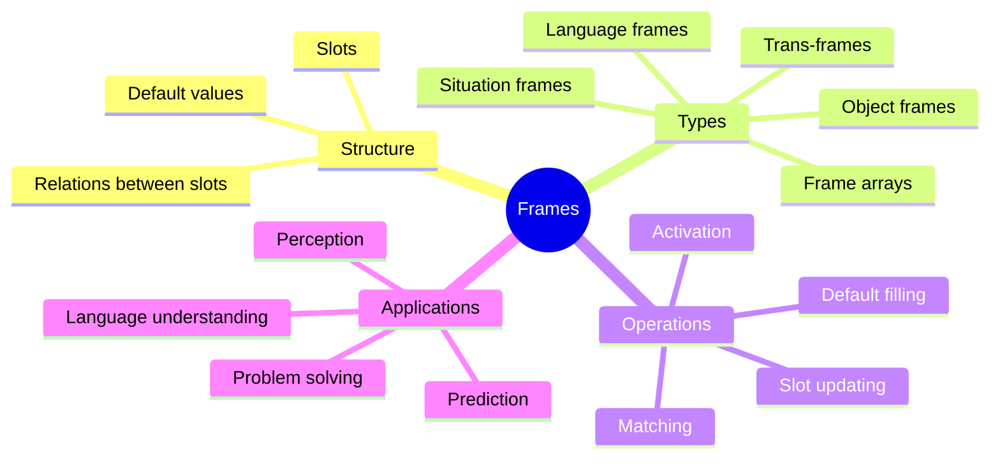

A **frame** is a data structure for representing a stereotyped situation. Inspired by the way we seem to have ready-made expectations for common experiences, frames consist of a network of slots that hold information about the expected components of a situation, along with default values for those slots.

When you walk into a restaurant, you instantly activate a "restaurant frame" with slots for tables, chairs, a menu, a server, and food. The default values let you navigate the situation even before you observe all the details. If something violates a default — say, there are no chairs — you notice immediately because the expectation was already in place.

Frames are one of Minsky's most influential contributions. They influenced the development of object-oriented programming, database schema design, and modern AI knowledge representation. In the society of mind, frames are managed by specialized agencies that select, activate, and update frames as situations evolve.

Frame theory also extends to more specialized structures: **trans-frames** represent changes and actions, **frame arrays** link multiple perspectives of the same object, and **language frames** structure sentence understanding.

## Where This Appears

| Chapter | Context |
|---------|---------|
| [Ch. 13: Seeing and Believing](/chapters/13-seeing-and-believing/overview/) | Frames guiding perception |
| [Ch. 21: Trans-Frames](/chapters/21-trans-frames/overview/) | Frames for representing change |
| [Ch. 24: Frames](/chapters/24-frames/overview/) | Frame theory in full depth |
| [Ch. 25: Frame Arrays](/chapters/25-frame-arrays/overview/) | Collections of related frames |
| [Ch. 26: Language Frames](/chapters/26-language-frames/overview/) | Frames applied to language |

## Related Concepts

- [Trans-frames](/concepts/trans-frames/) — specialized frames for change and action
- [K-lines](/concepts/k-lines/) — memory connections that activate frames
- [Agents](/concepts/agents/) — the agents that manage and populate frames
- [Agencies](/concepts/agencies/) — frame-management agencies
