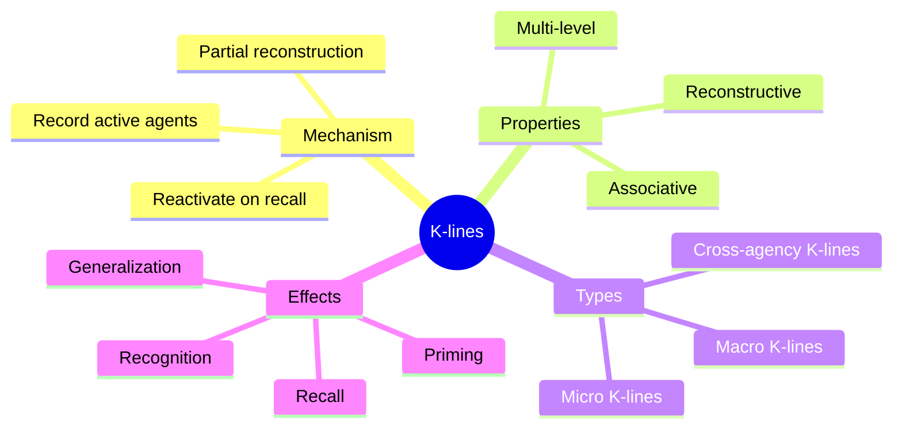

**K-lines** (knowledge lines) are Minsky's theory of how memory works. Rather than storing memories as static records — like files on a computer — K-lines work by recording *which agents were active* during a particular experience. Later, activating a K-line partially reactivates those same agents, reconstructing a version of the original mental state.

This explains several puzzling features of human memory. Memories are reconstructive rather than reproductive: each time you remember something, you rebuild it from available agents, which is why memories change over time. K-lines also explain why memory is associative — similar experiences share agents, so activating one memory can trigger related ones.

K-lines can operate at different levels: a "micro" K-line might record the activity of a few low-level agents, while a "macro" K-line might capture the overall configuration of an entire agency. This multi-level recording allows memories to range from specific sensory details to abstract generalizations.

## Where This Appears

| Chapter | Context |
|---------|---------|
| [Ch. 8: A Theory of Memory](/chapters/08-a-theory-of-memory/overview/) | K-lines introduced and explained |
| [Ch. 9: Summaries](/chapters/09-summaries/overview/) | K-lines capturing summaries |
| [Ch. 12: Learning Meaning](/chapters/12-learning-meaning/overview/) | K-lines contributing to meaning |
| [Ch. 15: Consciousness and Memory](/chapters/15-consciousness-and-memory/overview/) | K-lines and conscious experience |
| [Ch. 20: Context and Ambiguity](/chapters/20-context-and-ambiguity/overview/) | K-lines providing context |

## Related Concepts

- [Agents](/concepts/agents/) — the units whose activity K-lines record
- [Frames](/concepts/frames/) — structured knowledge that K-lines activate
- [Agencies](/concepts/agencies/) — the groups whose states K-lines capture
- [Consciousness](/concepts/consciousness/) — K-line activity and awareness
