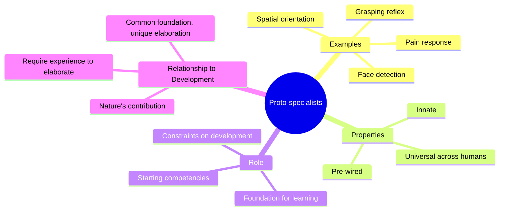

**Proto-specialists** are the agents we are born with — innate, pre-wired processes that provide basic competencies without requiring learning. These include agents for detecting faces, recognizing basic spatial relationships, responding to pain, and orienting toward sounds. Proto-specialists represent the genetic contribution to the society of mind.

Minsky argues that proto-specialists are not sufficient for intelligence on their own, but they provide the essential foundation upon which all learning builds. A newborn's proto-specialists give it basic abilities — sucking, grasping, orienting — that create the starting conditions for developmental growth.

Proto-specialists also constrain the kind of mind that can develop. Because certain basic agents are innate, all human minds share a common foundation. Individuality arises not from differences in proto-specialists (which are largely universal) but from the different ways that experience builds upon and organizes these innate components.

The concept bridges nature and nurture: proto-specialists are nature's contribution, but they require nurture — experience and interaction — to develop into the complex societies of agents that constitute a mature mind.

## Where This Appears

| Chapter | Context |
|---------|---------|
| [Ch. 1: Building Blocks](/chapters/01-building-blocks/overview/) | Innate agents as starting blocks |
| [Ch. 5: Individuality](/chapters/05-individuality/overview/) | Universal foundation, unique elaboration |
| [Ch. 10: Papert's Principle](/chapters/10-papert-principle/overview/) | Managing innate skills |
| [Ch. 17: Development](/chapters/17-development/overview/) | Proto-specialists in infant cognition |

## Related Concepts

- [Agents](/concepts/agents/) — proto-specialists are a specialized type of agent
- [Agencies](/concepts/agencies/) — innate agencies built from proto-specialists
- [K-lines](/concepts/k-lines/) — learned connections built on innate foundations
- [Consciousness](/concepts/consciousness/) — proto-specialists mostly operate unconsciously
