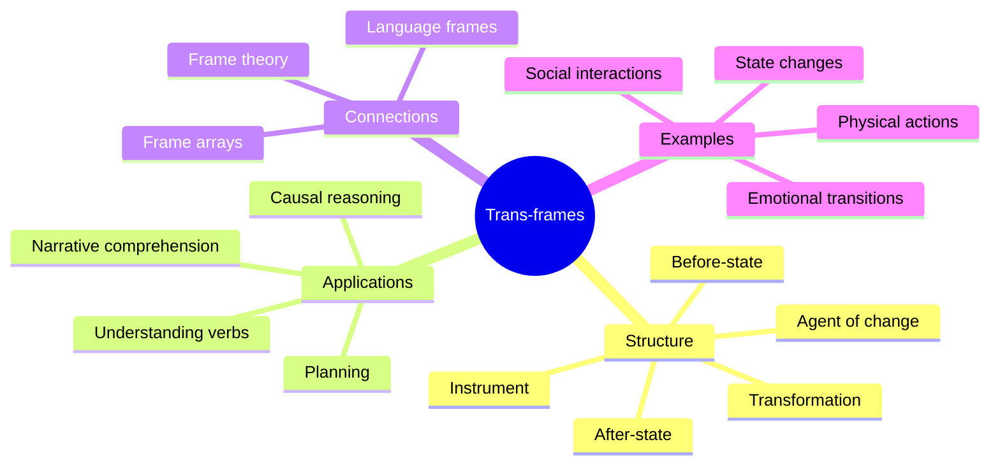

**Trans-frames** are a specialized type of frame designed to represent change. While ordinary frames capture static situations, trans-frames capture *transitions* — the movement from one state to another. A trans-frame has slots for the before-state, the after-state, the agent of change, and the instrument or method of transformation.

Trans-frames are essential for understanding verbs, causation, and narrative. When you hear "John broke the window," a trans-frame is activated with John as the agent, the window's intact state as "before," the window's broken state as "after," and the breaking action as the transformation. This structure lets you reason about causes, predict effects, and understand stories.

Minsky argues that trans-frames are one of the mind's most versatile representations. They underlie our understanding of physical actions, abstract processes, social interactions, and even emotional changes. The ability to represent "before" and "after" states is fundamental to planning, learning from experience, and communicating about events.

Trans-frames connect to frame arrays by providing the transitions between different frames in a sequence, and to language frames by providing the semantic structure for action verbs.

## Where This Appears

| Chapter | Context |
|---------|---------|
| [Ch. 14: Reformulation](/chapters/14-reformulation/overview/) | Transforming between representations |
| [Ch. 21: Trans-Frames](/chapters/21-trans-frames/overview/) | Full treatment of trans-frame theory |
| [Ch. 24: Frames](/chapters/24-frames/overview/) | Trans-frames within general frame theory |
| [Ch. 25: Frame Arrays](/chapters/25-frame-arrays/overview/) | Transitions between frame perspectives |
| [Ch. 26: Language Frames](/chapters/26-language-frames/overview/) | Trans-frames and verb semantics |

## Related Concepts

- [Frames](/concepts/frames/) — the general theory that trans-frames extend
- [K-lines](/concepts/k-lines/) — memory of past transitions
- [Agents](/concepts/agents/) — agents that detect and represent change
- [Agencies](/concepts/agencies/) — agencies specialized for tracking transformations
