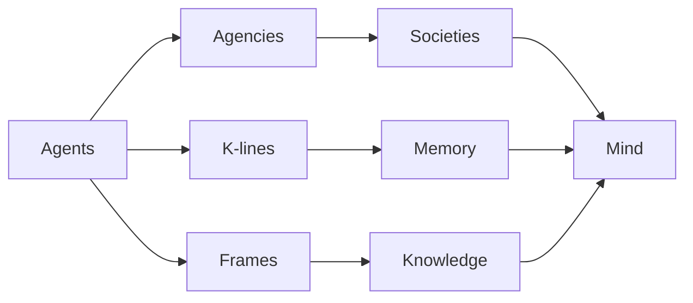
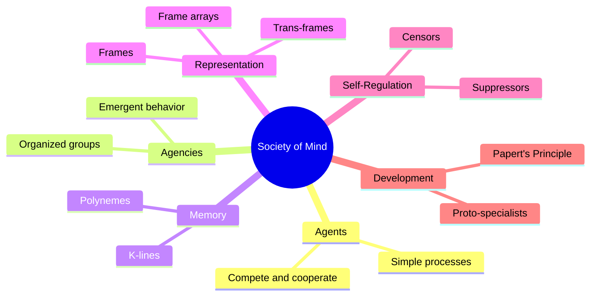

import { Card, CardGrid } from '@astrojs/starlight/components';

## The Central Idea

Marvin Minsky's *The Society of Mind* proposes a radical theory: **intelligence is not the product of any single mechanism but emerges from the interaction of many small, simple agents**. Each agent alone is mindless — incapable of thought on its own — yet together they form a "society" that gives rise to what we experience as a unified mind.

> *"You can build a mind from many little parts, each mindless by itself."*
> — Marvin Minsky

## Book Structure

The book is organized into **30 chapters** spanning seven major parts, each building upon the last to construct a complete theory of mind.

<CardGrid>
  <Card title="Part I: Introduction (Ch. 1-3)" icon="rocket">
    The building blocks of mind — agents, agencies, and how they interact through conflict and compromise.
  </Card>
  <Card title="Part II: Self & Identity (Ch. 4-6)" icon="star">
    How the self emerges, individuality forms, and the limits of introspection.
  </Card>
  <Card title="Part III: Goals & Memory (Ch. 7-9)" icon="puzzle">
    Problem-solving, theories of memory, and how the mind summarizes experience.
  </Card>
  <Card title="Part IV: Learning & Perception (Ch. 10-14)" icon="open-book">
    Papert's Principle, spatial reasoning, learning meaning, seeing, and reformulation.
  </Card>
  <Card title="Part V: Inner Experience (Ch. 15-17)" icon="heart">
    Consciousness, emotion, and cognitive development across the lifespan.
  </Card>
  <Card title="Part VI: Language & Thought (Ch. 18-23)" icon="translate">
    Reasoning, words, ambiguity, trans-frames, expression, and comparisons.
  </Card>
  <Card title="Part VII: Frames & Beyond (Ch. 24-30)" icon="seti:json">
    Frame theory, language frames, censors, the mind-world relationship, and the nature of the soul.
  </Card>
</CardGrid>

## Core Concepts

Minsky introduces a rich vocabulary of interacting mechanisms. These concepts weave through every chapter.

<CardGrid>
  <Card title="Agents" icon="seti:config">
    The simplest mental processes — tiny, mindless parts that each do one small thing. [Learn more](/concepts/agents/)
  </Card>
  <Card title="Agencies" icon="seti:folder">
    Organized groups of agents that work together to accomplish larger tasks. [Learn more](/concepts/agencies/)
  </Card>
  <Card title="K-lines" icon="random">
    Mental connections that record and reactivate the states of agents involved in past experiences. [Learn more](/concepts/k-lines/)
  </Card>
  <Card title="Frames" icon="seti:json">
    Data structures for representing stereotyped situations and knowledge. [Learn more](/concepts/frames/)
  </Card>
  <Card title="Censors & Suppressors" icon="warning">
    Internal critics that prevent the mind from repeating known mistakes. [Learn more](/concepts/censors/)
  </Card>
  <Card title="Proto-specialists" icon="seti:default">
    Built-in agents that provide basic competencies from birth. [Learn more](/concepts/proto-specialists/)
  </Card>
  <Card title="Trans-frames" icon="right-arrow">
    Representations of changes, actions, and transitions between states. [Learn more](/concepts/trans-frames/)
  </Card>
  <Card title="Consciousness" icon="sun">
    The illusion of a unified self, constructed from many unconscious processes. [Learn more](/concepts/consciousness/)
  </Card>
</CardGrid>

## Learning Paths

Choose a guided journey through the book based on your interests and experience.

<CardGrid>
  <Card title="Foundations of Mind" icon="rocket">
    **Beginner** — Start here. Covers the essential building blocks: agents, agencies, self, and goals (Chapters 1-7). [Begin path](/paths/foundations/)
  </Card>
  <Card title="Architecture of Thought" icon="puzzle">
    **Intermediate** — Dive into memory, learning, perception, consciousness, and language (Chapters 8-21). [Begin path](/paths/architecture/)
  </Card>
  <Card title="The Nature of Intelligence" icon="star">
    **Advanced** — Explore frames, censors, the mind-world boundary, and the nature of the soul (Chapters 22-30). [Begin path](/paths/intelligence/)
  </Card>
</CardGrid>

## Key Comparisons

| Concept | What It Is | Scale | Example |
|---------|-----------|-------|---------|
| **Agent** | A single, simple process | Smallest unit | A neuron-like detector for edges |
| **Agency** | An organized group of agents | Mid-level | The "Builder" agency for stacking blocks |
| **Society** | The entire collection of agencies | Whole mind | The full network that produces thought |

## About This Companion

This companion provides two reading modes:

- **Original text** — Read Minsky's essays with visual annotations and concept links.
- **Side-by-side view** — Read the original text alongside AI-generated explanations, diagrams, and modern context.

Use the chapter overviews, concept pages, and learning paths to navigate this rich and interconnected theory of how minds work.
