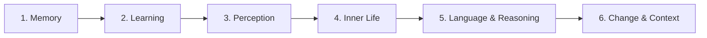

This path covers the rich middle section of the book where Minsky develops the detailed architecture of the mind. You will explore how memory works through K-lines, how learning acquires meaning, how perception constructs reality, how consciousness relates to memory, how emotions reshape thinking, how reasoning operates, and how language connects to thought.

**Prerequisites:** Complete the [Foundations of Mind](/paths/foundations/) path or be familiar with agents, agencies, and the basic society of mind framework.

## Step 1: Memory and Summaries

**Goal:** Understand K-lines and how the mind compresses experience.

**Read:** [Chapter 8: A Theory of Memory](/read/original/08-a-theory-of-memory/) | [Side-by-side](/read/side-by-side/08-a-theory-of-memory/) and [Chapter 9: Summaries](/read/original/09-summaries/) | [Side-by-side](/read/side-by-side/09-summaries/)

**Key concept:** K-lines record which agents were active and can reactivate them later. Memories are reconstructed, not retrieved. Summaries compress detail for efficient thinking.

**Check your understanding:** Why do memories change each time we recall them?

## Step 2: Learning and Development

**Goal:** Explore how skills are managed and how meaning accumulates.

**Read:** [Chapter 10: Papert's Principle](/read/original/10-papert-principle/) | [Side-by-side](/read/side-by-side/10-papert-principle/) and [Chapter 12: Learning Meaning](/read/original/12-learning-meaning/) | [Side-by-side](/read/side-by-side/12-learning-meaning/)

**Key concept:** The biggest cognitive leaps come from learning to manage existing skills, not from acquiring new ones. Meaning is a distributed pattern of activation across agencies, not a definition.

**Check your understanding:** What is a polyneme, and how does it create distributed meaning?

## Step 3: Perception and Reformulation

**Goal:** See how perception constructs experience and how problems get transformed.

**Read:** [Chapter 11: The Shape of Space](/read/original/11-the-shape-of-space/) | [Side-by-side](/read/side-by-side/11-the-shape-of-space/), [Chapter 13: Seeing and Believing](/read/original/13-seeing-and-believing/) | [Side-by-side](/read/side-by-side/13-seeing-and-believing/), and [Chapter 14: Reformulation](/read/original/14-reformulation/) | [Side-by-side](/read/side-by-side/14-reformulation/)

**Key concept:** Seeing is not passive recording but active construction guided by expectations. Spatial reasoning underlies abstract thought. Finding the right representation can make impossible problems easy.

**Check your understanding:** How do expectations change what we literally perceive?

## Step 4: Consciousness, Emotion, and Development

**Goal:** Understand the inner life of the society of mind.

**Read:** [Chapter 15: Consciousness and Memory](/read/original/15-consciousness-and-memory/) | [Side-by-side](/read/side-by-side/15-consciousness-and-memory/), [Chapter 16: Emotion](/read/original/16-emotion/) | [Side-by-side](/read/side-by-side/16-emotion/), and [Chapter 17: Development](/read/original/17-development/) | [Side-by-side](/read/side-by-side/17-development/)

**Key concept:** Consciousness is a pattern of self-monitoring activity, not a special substance. Emotions are ways of thinking that reconfigure which agents are active. Development proceeds in layers.

**Check your understanding:** In what sense are emotions a form of thinking rather than its opposite?

## Step 5: Reasoning, Words, and Ideas

**Goal:** Explore how the mind reasons and how language shapes thought.

**Read:** [Chapter 18: Reasoning](/read/original/18-reasoning/) | [Side-by-side](/read/side-by-side/18-reasoning/) and [Chapter 19: Words and Ideas](/read/original/19-words-and-ideas/) | [Side-by-side](/read/side-by-side/19-words-and-ideas/)

**Key concept:** Most reasoning is not formal logic but analogy and heuristic shortcuts. Words are agents that activate idea networks — learning a word means acquiring a new mental tool.

**Check your understanding:** Why does Minsky argue that analogy is more fundamental than logic?

## Step 6: Context, Ambiguity, and Trans-Frames

**Goal:** Understand how the mind handles change and ambiguity.

**Read:** [Chapter 20: Context and Ambiguity](/read/original/20-context-and-ambiguity/) | [Side-by-side](/read/side-by-side/20-context-and-ambiguity/) and [Chapter 21: Trans-Frames](/read/original/21-trans-frames/) | [Side-by-side](/read/side-by-side/21-trans-frames/)

**Key concept:** Context agents resolve pervasive ambiguity through priming and suppression. Trans-frames represent change by capturing before-states, after-states, and transformations.

**Check your understanding:** How does a trans-frame help you understand a sentence like "The ice melted"?

## Next Steps

Continue to [The Nature of Intelligence](/paths/intelligence/) to explore frames, censors, and the deepest questions about mind.
