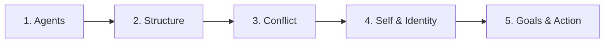

This path covers the foundational concepts of Minsky's theory: what agents are, how they organize into agencies, how conflict is resolved, what the self is, how individuality emerges, the limits of introspection, and how goals drive behavior. By the end, you will have a solid grasp of the core vocabulary and framework.

## Step 1: What Are Agents?

**Goal:** Understand the fundamental building blocks of mind.

**Read:** [Chapter 1: Building Blocks](/read/original/01-building-blocks/) | [Side-by-side](/read/side-by-side/01-building-blocks/)

**Key concept:** An agent is a simple, mindless process. Intelligence emerges from many agents interacting, not from any single sophisticated component. Think of the Builder example — grasping, seeing, and placing are each handled by separate agents.

**Check your understanding:** Can you explain why no single agent needs to be intelligent for the whole system to behave intelligently?

## Step 2: Parts and Wholes

**Goal:** Understand how complex behavior arises from simple parts.

**Read:** [Chapter 2: Wholes and Parts](/read/original/02-wholes-and-parts/) | [Side-by-side](/read/side-by-side/02-wholes-and-parts/)

**Key concept:** The feeling of "wholeness" in our experience is itself a product of how agents interact — it does not require a single central controller. Decomposing tasks into sub-problems is fundamental.

**Check your understanding:** Why does Minsky reject the idea that understanding the parts destroys understanding of the whole?

## Step 3: Conflict and Resolution

**Goal:** Learn how the mind handles internal disagreements.

**Read:** [Chapter 3: Conflict and Compromise](/read/original/03-conflict-and-compromise/) | [Side-by-side](/read/side-by-side/03-conflict-and-compromise/)

**Key concept:** Agents compete for control. Suppression, inhibition, and compromise are the tools the mind uses to resolve internal conflicts without any central judge.

**Check your understanding:** How does the mind decide between competing goals without a central decision-maker?

## Step 4: Self and Identity

**Goal:** Rethink what "self" and "individuality" mean.

**Read:** [Chapter 4: The Self](/read/original/04-the-self/) | [Side-by-side](/read/side-by-side/04-the-self/) and [Chapter 5: Individuality](/read/original/05-individuality/) | [Side-by-side](/read/side-by-side/05-individuality/)

**Key concept:** The self is a model the mind builds of itself — not a fixed entity but a shifting coalition. Individuality arises from unique connection patterns, not unique agent types.

**Check your understanding:** If all humans share similar agent types, what makes each mind unique?

## Step 5: Goals and Limits

**Goal:** Understand how the mind sets goals and why introspection is unreliable.

**Read:** [Chapter 6: Insight and Introspection](/read/original/06-insight-and-introspection/) | [Side-by-side](/read/side-by-side/06-insight-and-introspection/) and [Chapter 7: Problems and Goals](/read/original/07-problems-and-goals/) | [Side-by-side](/read/side-by-side/07-problems-and-goals/)

**Key concept:** Most mental work is unconscious; introspection gives us only a partial, constructed view. Goals are decomposed into sub-problems and distributed across agencies.

**Check your understanding:** Why can't we simply "look inward" to understand how our minds work?

## Next Steps

You now have the foundational vocabulary. Continue to [Architecture of Thought](/paths/architecture/) to explore memory, learning, perception, and language.
