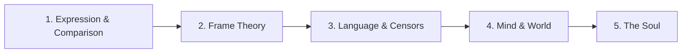

This path covers the final and most ambitious section of the book, where Minsky builds on everything before to address the deepest questions. You will explore how minds express themselves, how comparison and analogy drive creativity, the full power of frame theory, how censors connect to humor, the boundary between mind and world, the different realms of thought, and ultimately what it means for a society of agents to be a person.

**Prerequisites:** Complete the [Architecture of Thought](/paths/architecture/) path or be familiar with K-lines, frames, consciousness, and trans-frames.

## Step 1: Expression and Comparison

**Goal:** Understand how internal states become external communication and how comparison drives thought.

**Read:** [Chapter 22: Expression](/read/original/22-expression/) | [Side-by-side](/read/side-by-side/22-expression/) and [Chapter 23: Comparisons](/read/original/23-comparisons/) | [Side-by-side](/read/side-by-side/23-comparisons/)

**Key concept:** Expression requires a secondary society of agents that select, compress, and sequence ideas for output. Comparison — finding similarities and differences — is one of the mind's most fundamental and powerful operations, underlying analogy, classification, and creative thought.

**Check your understanding:** Why is there always a gap between what we think and what we can express?

## Step 2: Frame Theory in Depth

**Goal:** Master Minsky's frame theory — one of AI's most influential ideas.

**Read:** [Chapter 24: Frames](/read/original/24-frames/) | [Side-by-side](/read/side-by-side/24-frames/) and [Chapter 25: Frame Arrays](/read/original/25-frame-arrays/) | [Side-by-side](/read/side-by-side/25-frame-arrays/)

**Key concept:** Frames are data structures with slots and default values for representing stereotyped situations. Frame arrays link multiple perspectives of the same thing, enabling coherent perception despite changing viewpoints. Defaults explain why we understand new situations so quickly.

**Check your understanding:** How do default values in a frame help you navigate a room you have never been in before?

## Step 3: Language Frames and Censors

**Goal:** See how frame theory extends to language and how censors connect to humor.

**Read:** [Chapter 26: Language Frames](/read/original/26-language-frames/) | [Side-by-side](/read/side-by-side/26-language-frames/) and [Chapter 27: Censors and Jokes](/read/original/27-censors-and-jokes/) | [Side-by-side](/read/side-by-side/27-censors-and-jokes/)

**Key concept:** Sentences activate language frames with semantic slots. Censors prevent known mistakes; jokes work by bypassing censors to reveal suppressed ideas. "Negative knowledge" — knowing what *not* to do — is essential to intelligence.

**Check your understanding:** According to Minsky, why do we laugh at jokes?

## Step 4: Mind, World, and Thought

**Goal:** Explore the boundary between mind and reality and the different modes of thinking.

**Read:** [Chapter 28: The Mind and the World](/read/original/28-the-mind-and-the-world/) | [Side-by-side](/read/side-by-side/28-the-mind-and-the-world/) and [Chapter 29: The Realms of Thought](/read/original/29-the-realms-of-thought/) | [Side-by-side](/read/side-by-side/29-the-realms-of-thought/)

**Key concept:** The mind never contacts reality directly — it builds functional models. These models are incomplete and approximate but remarkably effective. Thought operates in multiple realms: concrete, abstract, and reflective, each engaging different agent types.

**Check your understanding:** If our mental models are always incomplete, how can they work so well?

## Step 5: The Soul

**Goal:** Confront the deepest question — what does it mean for a society of agents to be a person?

**Read:** [Chapter 30: The Soul](/read/original/30-the-soul/) | [Side-by-side](/read/side-by-side/30-the-soul/)

**Key concept:** Understanding how minds work does not diminish us. The society of mind, far from reducing personhood to mere mechanism, reveals the extraordinary complexity of what we are. The soul is not diminished by being understood — it is enriched.

**Check your understanding:** Does understanding the mechanism of mind reduce or enhance your sense of what it means to be a person?

## Completion

You have now journeyed through the entire *Society of Mind*. Return to the [Book Overview](/overview/) to explore concepts, revisit chapters, or begin again with fresh eyes.
